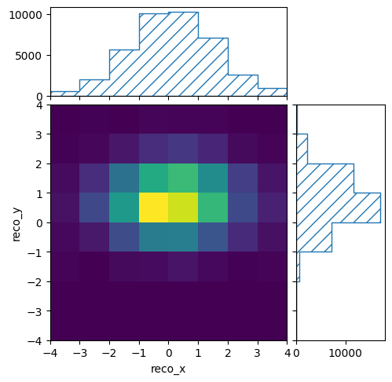
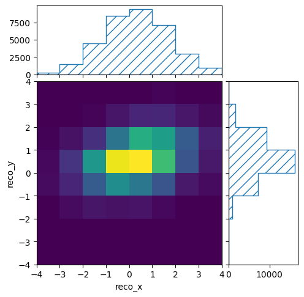
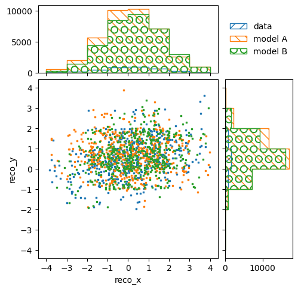
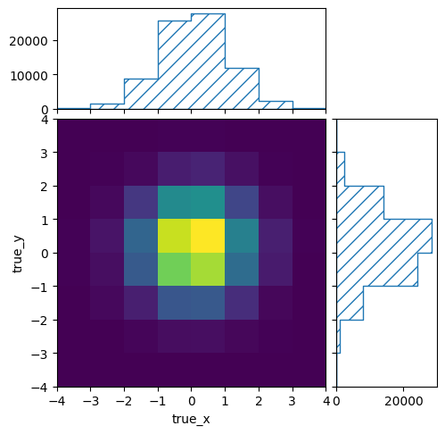
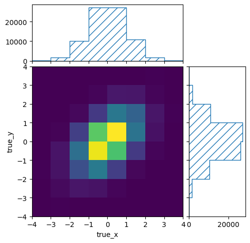
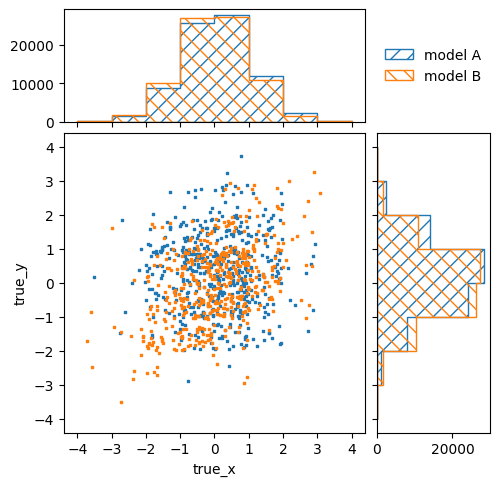

.. _example00:

=====================================
Example 00 -- Basic usage of binnings
=====================================

Aims
====

*   Create "real" and simulated data of the mock experiemnt
*   Load data into histograms and plot it

Instructions
============

The folder ``../simple_experiment/`` contains two scripts to create "real" and
simulated data. The script 'simulate_experiment.py' simulates the mock
experiment and creates two files: one file with the truth information of all
simulated events, and another file with the truth and reconstructed information
of all reconstructed events. The command line parameters determine the
properties of the simulation, e.g. whether to simulate background or signal and
what signal model to use.

The script ``run_experiment.py`` creates a single file with only reconstructed
information. Of course, this file is also  the result of simulations, but since
it is supposed to represent the real results of a real experiment, no truth
information is saved.

Create "real" data corresponding to ten years of running the experiment::

    $ ../simple_experiment/run_experiment.py 10 real_data.txt

Create simulated data corresponding to ten times the real data::

    $ ../simple_experiment/simulate_experiment.py 100 modelA modelA_data.txt modelA_truth.txt
    $ ../simple_experiment/simulate_experiment.py 100 modelB modelB_data.txt modelB_truth.txt

The file ``reco-binning.yml`` contains a :class:`.RectilinearBinning` object
for the reconstructed information::

    !RectilinearBinning
    variables:
    - reco_x
    - reco_y
    bin_edges:
    - [-.inf,
      ...
      .inf]
    - [-.inf,
      ...
      .inf]
    include_upper: false

A :class:`.RectilinearBinning` object defines bin edges in multiple variables.
These variables are orthogonal to each other. The total number of bins is thus
the product of the number of bins per variable.

Let's create a binning object, load the data into it, and plot the
distributions::

    from remu import binning
    from remu import plotting

    with open("reco-binning.yml", 'r') as f:
        reco_binning = binning.yaml.full_load(f)

    reco_binning.fill_from_csv_file("real_data.txt")

    pltr = plotting.get_plotter(reco_binning)
    pltr.plot_values()
    pltr.savefig("real_data.png")

.. image:: real_data.png

::

    reco_binning.reset()
    reco_binning.fill_from_csv_file("modelA_data.txt")

    pltr = plotting.get_plotter(reco_binning)
    pltr.plot_values()
    pltr.savefig("modelA_data.png")

::

    reco_binning.reset()
    reco_binning.fill_from_csv_file("modelB_data.txt")

    pltr = plotting.get_plotter(reco_binning)
    pltr.plot_values()
    pltr.savefig("modelB_data.png")

Plotting the different kinds of :class:`.Binning` objects is handled by their
respective :class:`.BinningPlotter` classes. The function
:func:`.plotting.get_plotter` will return an instance of the appropriate
plotting class for the provided binning, in this case a
:class:`.RectilinearBinningPlotter`.

The :class:`.RectilinearBinningPlotter` supports the ``scatter`` parameter,
which makes it draw pseudo scatter plots instead of 2D histograms. This is
useful to compare multiple distributions in the same plot::

    pltr = plotting.get_plotter(reco_binning)
    reco_binning.reset()
    reco_binning.fill_from_csv_file("real_data.txt")
    pltr.plot_values(label="data", scatter=500)
    reco_binning.reset()
    reco_binning.fill_from_csv_file("modelA_data.txt")
    pltr.plot_values(label="model A", scatter=500)
    reco_binning.reset()
    reco_binning.fill_from_csv_file("modelB_data.txt")
    pltr.plot_values(label="model B", scatter=500)
    pltr.legend()
    pltr.savefig("compare_data.png")

We can do the same with the true information and its respective binning in
'truth-binning.yml'::

    with open("truth-binning.yml", 'r') as f:
        truth_binning = binning.yaml.full_load(f)

    truth_binning.fill_from_csv_file("modelA_truth.txt")

    pltr = plotting.get_plotter(truth_binning)
    pltr.plot_values()
    pltr.savefig("modelA_truth.png")

::

    truth_binning.reset()
    truth_binning.fill_from_csv_file("modelB_truth.txt")

    pltr = plotting.get_plotter(truth_binning)
    pltr.plot_values()
    pltr.savefig("modelB_truth.png")

::

    pltr = plotting.get_plotter(truth_binning)
    truth_binning.reset()
    truth_binning.fill_from_csv_file("modelA_truth.txt")
    pltr.plot_values(label="model A", scatter=500)
    truth_binning.reset()
    truth_binning.fill_from_csv_file("modelB_truth.txt")
    pltr.plot_values(label="model B", scatter=500)
    pltr.legend()
    pltr.savefig("compare_truth.png")

