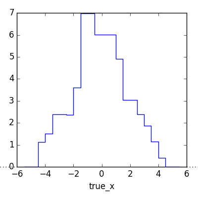

========================================
Example 01 -- Building a response matrix
========================================

Aims
====

*   Use simulated events to build detector response matrix
*   Test the model-independence of the matrix
*   Optimise the binning

Instructions
============

A response matrix describes the probabilities of true events to be
reconstructed with different reconstructed properties. It is defined by the
binning of events in truth and reco space, and the simulated events that are
used to fill the matrix.

Let us assume we would like to investigate the variable ``x`` of the example
data. The files ``reco-binning.yml`` and ``coarse-truth-binning.yml`` contain
the bin edges in ``x`` that we will use to build the response matrix. The
response matrix object is created using the respective binning objects::

    import matplotlib.pyplot as plt
    import numpy as np
    from scipy import stats
    from remu import binning
    from remu import migration
    from copy import deepcopy

    with open("reco-binning.yml", 'rt') as f:
        reco_binning = binning.yaml.load(f)
    with open("coarse-truth-binning.yml", 'rt') as f:
        truth_binning = binning.yaml.load(f)

    respA = migration.ResponseMatrix(reco_binning, truth_binning)

This object provides methods to populate it with simulated events::

    respA.fill_from_csv_file("../00/modelA_data.txt")

Often, the true distributions of the events before the selection are stored in
a dedicated data set. To get the efficiencies right, the response matrix
objects have a method to "top up" only the truth distributions::

    respA.fill_up_truth_from_csv_file("../00/modelA_truth.txt")

This will not affect the reconstructed distributions. It is assumed that the
reconstructed events are a subset of the truth events.

We can now take a look at the matrix using its various plotting methods.
The event migration can be plotted like this::

    respA.plot_values("response_matrixA.png", variables=(None, None))

.. image:: response_matrixA.png

We can also get an idea of the (projected) efficiencies for the different truth
bins. Stricly, this is only correct for the distribution of data that was used
for filling the matrix! A different data distribution, i.e. a different model,
can have very different (projected) efficiencies. In any case this can be
useful to get a feeling for the detector response::

    respA.plot_expected_efficiency("efficiencyA.png")

.. image:: efficiencyA.png

    respA.plot_in_bin_variation("inbin_var_A.png", variables=(None, None))

