.. _example01:

========================================
Example 01 -- Building a response matrix
========================================

Aims
====

*   Use simulated events to build detector response matrix
*   Test the model-independence of the matrix
*   Optimise the binning

Instructions
============

A response matrix describes the probabilities of true events to be
reconstructed with different reconstructed properties. It is defined by the
binning of events in truth and reco space, and the simulated events that are
used to fill the matrix.

Let us assume we would like to investigate the variable ``x`` of the example
data. The files ``reco-binning.yml`` and ``coarse-truth-binning.yml`` contain
the bin edges in ``x`` that we will use to build the response matrix. The
response matrix object is created using the respective binning objects::

    import numpy as np
    from remu import binning
    from remu import migration
    from remu import plotting
    from remu import matrix_utils

    with open("reco-binning.yml", 'rt') as f:
        reco_binning = binning.yaml.load(f)
    with open("coarse-truth-binning.yml", 'rt') as f:
        truth_binning = binning.yaml.load(f)

    respA = migration.ResponseMatrix(reco_binning, truth_binning)

This object provides methods to populate it with simulated events::

    respA.fill_from_csv_file("../00/modelA_data.txt")

Often, the true distributions of the events before the selection are stored in
a dedicated data set. To get the efficiencies right, the response matrix
objects have a method to "top up" only the truth distributions::

    respA.fill_up_truth_from_csv_file("../00/modelA_truth.txt")

This will not affect the reconstructed distributions. It is assumed that the
reconstructed events are a subset of the truth events.

We can now take a look at the matrix using its various plotting methods. The
mean migration matrix (ignoring statistical uncertainties) can be plotted like
this::

    matrix_utils.plot_mean_response_matrix(respA, "response_matrix_A.png")

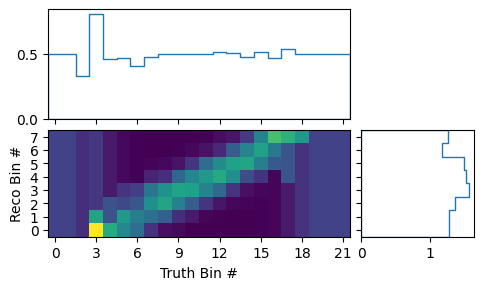

The sum of the matrix elements projected on the truth bins gives us the
efficiencies of the respective bins in the mean matrix. The very low and very
high bins seem to show a constant efficiency of exactly 0.5. This is caused by
the prior assumption of the response matrix. Before adding any actual events,
all efficiencies are considered to be equally likely and the mean of that flat
prior is 0.5. The low and high bins indeed have only very few events in them::

    plt = plotting.get_plotter(respA.truth_binning)
    plt.plot_entries()
    plt.savefig("entries_A.png")

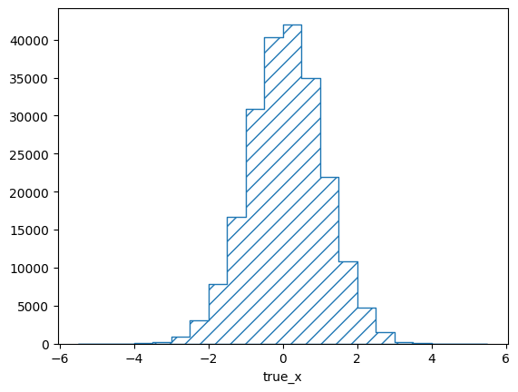

Note that the y-axis of this plot shows the *density* of events, i.e. the
number of events in the bin divided by the relative bin width. This behaviour
can be switched off with the ``density`` argument::

    plt = plotting.get_plotter(respA.truth_binning)
    plt.plot_entries(density=False, hatch=None)
    plt.savefig("abs_entries_A.png")

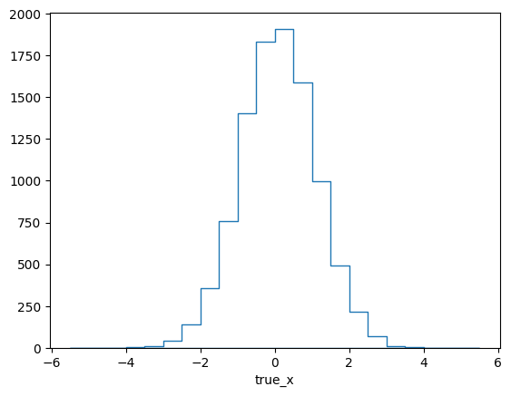

The efficiency of this matrix looks reasonably flat (within the statistical
fluctuations), and this would seem to make sense, since the efficiency of the
example experiment does not depend on ``x``. This is misleading though since
the plot implicitly integrates over ``y`` and its influence on the efficiency.
This can be seen when repeating the previous steps with a different model
("model B")::

    reco_binning = reco_binning.clone()
    truth_binning = truth_binning.clone()
    reco_binning.reset()
    truth_binning.reset()
    respB = migration.ResponseMatrix(reco_binning, truth_binning)

    respB.fill_from_csv_file("../00/modelB_data.txt")
    respB.fill_up_truth_from_csv_file("../00/modelB_truth.txt")

    matrix_utils.plot_mean_response_matrix(respB, "response_matrix_B.png")

Here the efficiency clearly varies over ``x``, despite the efficiency of the
detector not actually depending on it. The reason for this is simple: In model
B, ``x`` and ``y`` are correlated.

This implicit dependency on a variable that is not part of the truth binning,
leads to the two created response matrices being very different. We can see
that explicitly when plotting the Mahalanobis distance (i.e. "chi-square")
between the two matrices::

    matrix_utils.plot_mahalanobis_distance(respA, respB, "mahalanobis_distance.png")

.. image:: mahalanobis_distance.png

The differences are much larger than would be expected from purely statistical
fluctuations. This is also reflected in the overall distance between the
matrices, which can be used to define a compatibility score::

    respA.plot_compatibility("compatibility.png", respB)

.. image:: compatibility.png

The plot shows the expected distributions of distances according to the
statistical uncertainties, if the matrices were describing identical responses.
The vertical line shows the actual distance. The compatibility is defined as
the fraction of matrices in the distributions that have a larger distance than
the actually measured one.

It is obvious that the chosen binning is not sufficient to ensure a
model-independent response matrix. We clearly need to bin the truth also in
``y`` to cover the differences in the detector response. It is important to
keep in mind that in general, this kind of dependence might not show up clearly
in all cases. If the models used to build the response matrix are too similar,
the matrices might evaluate as compatible despite remaining model dependence in
the binning. It is important to understand the detector and analysis from first
principles and use that understanding to identify possible causes of varying
responses.

So let us re-do the previous steps with a finer truth-binning, also taking
``y`` into account::

    with open("reco-binning.yml", 'rt') as f:
        reco_binning = binning.yaml.load(f)
    with open("fine-truth-binning.yml", 'rt') as f:
        truth_binning = binning.yaml.load(f)

    respA = migration.ResponseMatrix(reco_binning, truth_binning)
    reco_binning = reco_binning.clone()
    truth_binning = truth_binning.clone()
    respB = migration.ResponseMatrix(reco_binning, truth_binning)

    respA.fill_from_csv_file("../00/modelA_data.txt")
    respA.fill_up_truth_from_csv_file("../00/modelA_truth.txt")

    respB.fill_from_csv_file("../00/modelB_data.txt")
    respB.fill_up_truth_from_csv_file("../00/modelB_truth.txt")

The correlation between ``x`` and ``y`` is now apparent in the plot of events
in the truth binning of response matrix B::

    plt = plotting.get_plotter(respB.truth_binning)
    plt.plot_entries()
    plt.savefig("fine_entries_B.png")

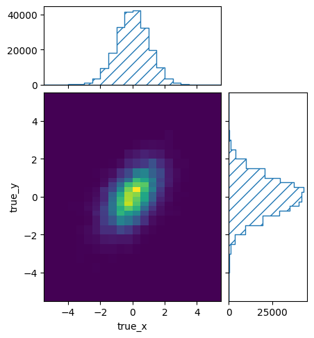

Because of the fine 2D binning of the true events, the matrix itself has become
a bit unwieldy::

    matrix_utils.plot_mean_response_matrix(respB, "fine_response_matrix_A.png")

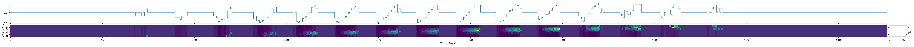

To get a better idea of how the mean efficiencies vary over the different truth
variables, we can plot the projected minimum, maximum, and median
efficiencies::

    matrix_utils.plot_mean_efficiency(respA, "fine_efficiency_A.png")

::

    matrix_utils.plot_mean_efficiency(respB, "fine_efficiency_B.png")

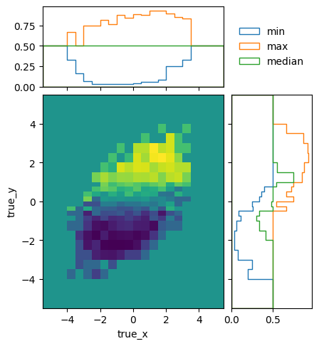

The efficiencies of the two models are not identical, due to statistical
fluctuations and different phase space coverage. The differences are very close
to the expectations though::

    matrix_utils.plot_mahalanobis_distance(respA, respB, "fine_mahalanobis_distance.png")

.. image:: fine_mahalanobis_distance.png

In fact, the two matrices are perfectly compatible within the statistical
uncertainties::

    matrix_utils.plot_compatibility(respA, respB, "fine_compatibility.png")

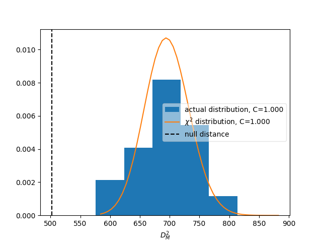

Since the two matrices are compatible with each other, and we are confident
that the binning ensures a physics-model-independent matrix, we can use the
simulated of both model A and model B to build the detector response matrix.
This can be done by filling a new matrix with the data from all the available
files::

    resp.fill_from_csv_file(["../00/modelA_data.txt", "../00/modelB_data.txt"])
    resp.fill_up_truth_from_csv_file(["../00/modelA_truth.txt", "../00/modelB_truth.txt"])

But since we already have the two individual matrices, it is easier to just
combine them::

    resp = respA + respB

Another quality criterion for response matrices is the variation of the detector response
*within* a single bin. It is estimated from the differences between neighbouring bins and
can be plotted like this::

    matrix_utils.plot_in_bin_variation(resp, "fine_inbin_var.png")

It should be compared to the statistical uncertainty of the matrix elements::

    matrix_utils.plot_statistical_uncertainty(resp, "fine_stat_var.png")

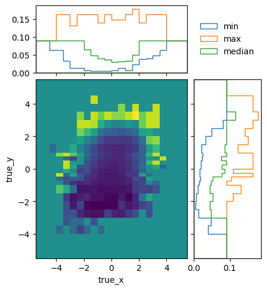

The easiest way to do that is by plotting the in-bin variance normalized by the
statistical uncertainty. If the in-bin variation is much larger than the
statistical uncertainty, this indicates that the bins are too wide to reflect a
rapid change of detector response::

    matrix_utils.plot_relative_in_bin_variation(resp, "fine_rel_inbin_var.png")

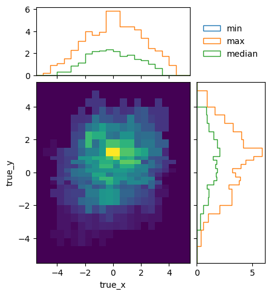

In this case, the in-bin variation is of the same order as the statistical uncertainty.

The combined matrix still has lots of bins with very low statistics at the
edges::

    plt = plotting.get_plotter(resp.truth_binning)
    plt.plot_entries()
    plt.savefig("fine_entries.png")

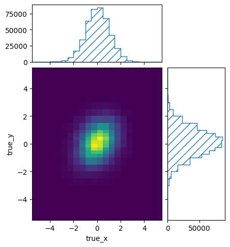

We can increase the statistics in the sparsely populated bins by increasing the
size of those bins. This can be done manually by modifying the truth binning
file. Alternatively, the :mod:`.matrix_utils` module offers a function to merge
some bins to try to increase the minimum number of events per bin::

    entries = resp.get_truth_entries_as_ndarray()
    optimised = resp
    while np.min(entries) < 10:
        optimised = matrix_utils.improve_stats(optimised)
        entries = optimised.get_truth_entries_as_ndarray()

This will keep removing bin edges of the bins with the lowest number of events
until the required minimum is reached. The result is a matrix with at least 10
events in every single truth bin::

    plt = plotting.get_plotter(optimised.truth_binning)
    plt.plot_entries()
    plt.savefig("optimised_entries.png")

.. image:: optimised_entries.png

To see how the bins compare, it is useful to plot the entries without an area
normalization::

    plt = plotting.get_plotter(optimised.truth_binning)
    plt.plot_entries(density=False, label="min", hatch=None, margin_function=np.min)
    plt.plot_entries(density=False, label="max", hatch=None, margin_function=np.max)
    plt.plot_entries(density=False, label="median", hatch=None, margin_function=np.median)
    plt.legend()
    plt.savefig("optimised_abs_entries.png")

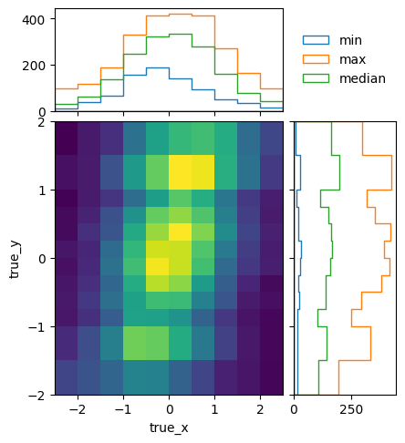

Let us quickly check that the efficiencies of the resulting matrix behave as
expected::

    matrix_utils.plot_mean_efficiency(optimised, "optimised_efficiency.png")

.. image:: optimised_efficiency.png

As well as that the in-bin variation is reasonable::

    matrix_utils.plot_relative_in_bin_variation(optimised, "optimised_rel_inbin_var.png")

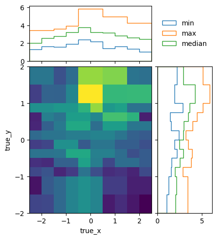

And just to be sure, we can check again whether the matrices generated with the
single models A and B are still compatible with the optimised truth binning::

    with open("reco-binning.yml", 'rt') as f:
        reco_binning = binning.yaml.load(f)
    with open("optimised-truth-binning.yml", 'rt') as f:
        truth_binning = binning.yaml.load(f)

    respA = migration.ResponseMatrix(reco_binning, truth_binning)
    reco_binning = reco_binning.clone()
    truth_binning = truth_binning.clone()
    respB = migration.ResponseMatrix(reco_binning, truth_binning)
    respA.fill_from_csv_file("../00/modelA_data.txt")
    respA.fill_up_truth_from_csv_file("../00/modelA_truth.txt")
    respB.fill_from_csv_file(["../00/modelB_data.txt"])
    respB.fill_up_truth_from_csv_file(["../00/modelB_truth.txt"])
    matrix_utils.plot_mahalanobis_distance(respA, respB, "optimised_mahalanobis_distance.png")

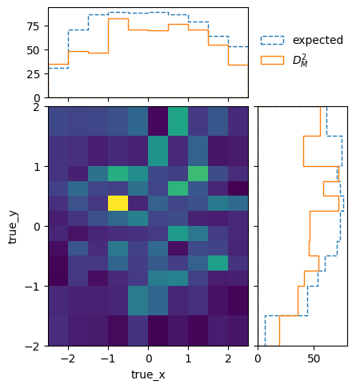

::

    matrix_utils.plot_compatibility(respA, respB, "optimised_compatibility.png")

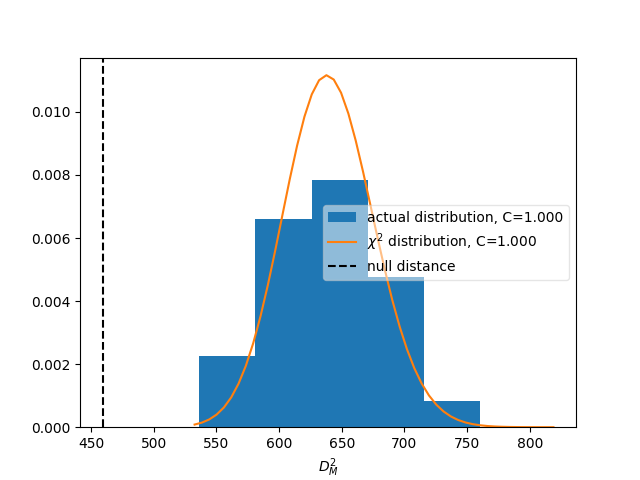

Now that that we are confident in the quality of the final response matrix, we
must save the necessary information for the model comparisons in later example
steps::

    with open("optimised-truth-binning.yml", 'w') as f:
        binning.yaml.dump(optimised.truth_binning, f)

    optimised.export("response_matrix.npz")

This will export the mean response matrix, as well as some auxiliary
information that is required for the calculation of likelihoods and hypothesis
tests.
