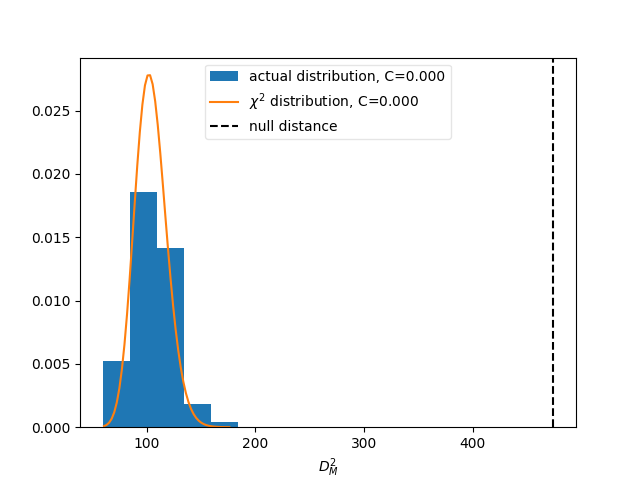
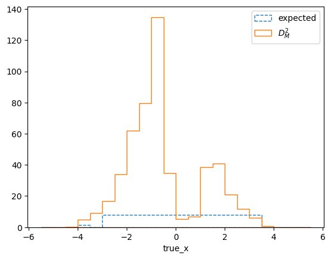
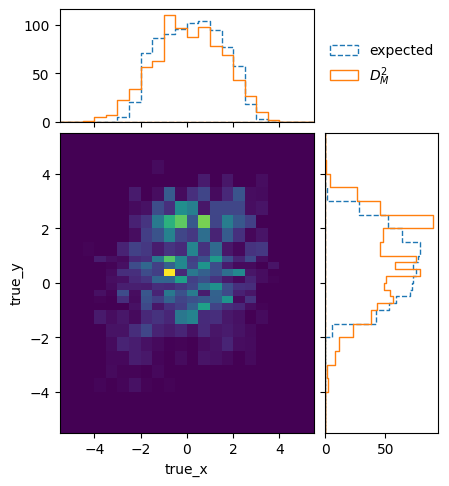
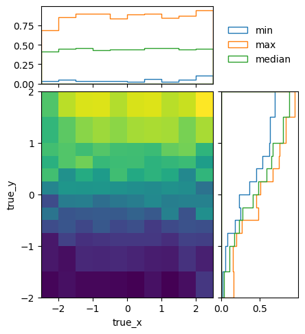

========================================
Example 01 -- Building a response matrix
========================================

Aims
====

*   Use simulated events to build detector response matrix
*   Test the model-independence of the matrix
*   Optimise the binning

Instructions
============

A response matrix describes the probabilities of true events to be
reconstructed with different reconstructed properties. It is defined by the
binning of events in truth and reco space, and the simulated events that are
used to fill the matrix.

Let us assume we would like to investigate the variable ``x`` of the example
data. The files ``reco-binning.yml`` and ``coarse-truth-binning.yml`` contain
the bin edges in ``x`` that we will use to build the response matrix. The
response matrix object is created using the respective binning objects::

    import matplotlib.pyplot as plt
    import numpy as np
    from scipy import stats
    from remu import binning
    from remu import migration
    from copy import deepcopy

    with open("reco-binning.yml", 'rt') as f:
        reco_binning = binning.yaml.load(f)
    with open("coarse-truth-binning.yml", 'rt') as f:
        truth_binning = binning.yaml.load(f)

    respA = migration.ResponseMatrix(reco_binning, truth_binning)

This object provides methods to populate it with simulated events::

    respA.fill_from_csv_file("../00/modelA_data.txt")

Often, the true distributions of the events before the selection are stored in
a dedicated data set. To get the efficiencies right, the response matrix
objects have a method to "top up" only the truth distributions::

    respA.fill_up_truth_from_csv_file("../00/modelA_truth.txt")

This will not affect the reconstructed distributions. It is assumed that the
reconstructed events are a subset of the truth events.

We can now take a look at the matrix using its various plotting methods.
The event migration can be plotted like this::

    respA.plot_values("response_matrixA.png", variables=(None, None))

.. image:: response_matrixA.png

We can also get an idea of the (projected) efficiencies for the different truth
bins. Stricly, this is only correct for the distribution of data that was used
for filling the matrix! A different data distribution, i.e. a different model,
can have very different (projected) efficiencies. In any case this can be
useful to get a feeling for the detector response::

    respA.plot_expected_efficiency("efficiencyA.png")

.. image:: efficiencyA.png

This efficiency looks reasonably flat (within the statistical fluctuations),
and this would seem to make sense, since the efficiency of the example
experiment does not depend on ``x``. This is misleading though since the plot
implicitly integrates over ``y`` and its influence on the efficiency. This can
be seen when repeating the previous steps with a different model ("model B")::

    reco_binning = deepcopy(reco_binning)
    truth_binning = deepcopy(truth_binning)
    respB = migration.ResponseMatrix(reco_binning, truth_binning)
    respB.fill_from_csv_file(["../00/modelB_data.txt"])
    respB.fill_up_truth_from_csv_file(["../00/modelB_truth.txt"])
    respB.plot_expected_efficiency("efficiencyB.png")

.. image:: efficiencyB.png

Here the efficiency clearly varies over ``x``, despite the efficiency of the
detector not actually depending on it. The reason for this is simple: In model
B, ``x`` and ``y`` are correlated.

This implicit dependency on a variable that is not part of the truth binning,
leads to the two created response matrices being very different. We can see
that explicitly when plotting the matrix compatibility::

    respA.plot_compatibility("compatibility.png", respB)

The Mahalanobis distance (i.e. "chi-square") between the two matrices (vertical
line) is much larger than you would expect from statistical variations of
matrices describing the same detector (curve and histogram). We can even take a
look at what bins are showing the biggest difference::

    respA.plot_distance("mahalanobis_distance.png", respB, expectation=True, variables=(None, None))

The difference in the bins around 0 and at large ``x`` are as you would expect
from a purely statistical variation (dashed line). The intermediate bins on the
other hand are much more different than can be explained by statistics.

It is obvious that the chosen binning is not sufficient to ensure a
model-independent response matrix. We clearly need to bin the truth also in
``y`` to cover the differences in the detector response. It is important to
keep in mind that in general, this kind of dependence might not obviously show
up, if the models one is using to build the response matrix are too similar. It
is important to understand the detector and analysis from first principles and
use that understanding to identify possible causes of varying responses.

So let us re-do the previous steps with a finer truth-binning, also taking ``y`` into account::

    with open("reco-binning.yml", 'rt') as f:
        reco_binning = binning.yaml.load(f)
    with open("fine-truth-binning.yml", 'rt') as f:
        truth_binning = binning.yaml.load(f)

    respA = migration.ResponseMatrix(reco_binning, truth_binning)
    reco_binning = deepcopy(reco_binning)
    truth_binning = deepcopy(truth_binning)
    respB = migration.ResponseMatrix(reco_binning, truth_binning)

    respA.fill_from_csv_file("../00/modelA_data.txt")
    respA.fill_up_truth_from_csv_file("../00/modelA_truth.txt")

    respB.fill_from_csv_file(["../00/modelB_data.txt"])
    respB.fill_up_truth_from_csv_file(["../00/modelB_truth.txt"])

The correlation between ``x`` and ``y`` is now apparent in the plot of response
matrix B::

    respB.plot_values("fine_response_matrixB.png", variables=(None, None))

.. image:: fine_response_matrixB.png

The expected projected efficiencies of the two matrices are still different.
The efficiency over ``x`` is still flat in matrix A::

    respA.plot_expected_efficiency("fine_efficiencyA.png")

.. image:: fine_efficiencyA.png

But you can see now that the efficiency depends very strongly on ``y``.
The expected efficiency in matrix B still shows the variation over ``x`` due to the correlation of ``x`` and ``y`` in model B::

    respB.plot_expected_efficiency("fine_efficiencyB.png")

.. image:: fine_efficiencyB.png

The projected efficiencies look very different between the matrices, due to the
different model assumptions. Since we are binning in all relevant variables now,
the two matrices are actually compatible to one another, though::

    respA.plot_compatibility("fine_compatibility.png", respB)

.. image:: fine_compatibility.png

This is true for the full phase-space covered by the two models::

    respA.plot_distance("fine_mahalanobis_distance.png", respB, expectation=True, variables=(None, None))

Since the two matrices are completely compatible with one another and we are
confident that the binning ensures a physics-model-independent matrix, we can
use the simulated of both model A and model B to build the detector response
matrix. This can be done by filling a new matrix with the data from all the
available files::

    resp.fill_from_csv_file(["../00/modelA_data.txt", "../00/modelB_data.txt"])
    resp.fill_up_truth_from_csv_file(["../00/modelA_truth.txt", "../00/modelB_truth.txt"])

But since we already have the two individual matrices, it is easier to just
combine them::

    resp = respA + respB

The combined matrix still has lots of bins with very low statistics at the
edges::

    resp.plot_values("fine_response_matrix.png", variables=(None, None))

.. image:: fine_response_matrix.png

And the estimated variation of detector response inside the bins is comparable
to the statistical uncertainty of the matrix elements::

    resp.plot_in_bin_variation("fine_inbin_var.png", variables=(None, None))

.. image:: fine_inbin_var.png

This plot shows the maximum in-bin variation divided by the statistical
uncertainty of the matrix elements.

We can increase the statistics in the sparsely populated bins by increasing the
size of those bins. This can be done by hand by modifying the truth binning file.
Alternatively the response matrix object offers a method to automate this::

    optimised = resp.maximize_stats_by_rebinning()

This will keep removing bin edges of the bins with the lowest number of events
until the in-bin variation reaches a set limit (defaul: 5). The result is more
densely populated::

    optimised.plot_values("optimised_response_matrix.png", variables=(None, None))

.. image:: optimised_response_matrix.png

This plot only shows events that have been reconstructed. So the region of low
``y`` looks unpopulated, but this is only due to the low efficiency::

    optimiesd.plot_expected_efficiency("optimised_efficiency.png", variables=(None, None))

The resulting in-bin variation is still below 5 for all bins by construction::

    optimised.plot_in_bin_variation("optimised_inbin_var.png", variables=(None, None))

.. image:: optimised_inbin_var.png

Now that the final response matrix has been created, we must save the necessary
information for the model comaprisons in later example steps::

    with open("optimised-truth-binning.yml", 'w') as f:
        binning.yaml.dump(optimised.truth_binning, f)

    M = optimised.get_response_matrix_as_ndarray()
    np.save("response_matrix.npy", M)

    entries = optimised.get_truth_entries_as_ndarray()
    np.save("generator_truth.npy", entries)

And just to be sure, we can check again whether the matrices generated with the
single models A and B are still compatible with the optimised truth binning::

    with open("reco-binning.yml", 'rt') as f:
        reco_binning = binning.yaml.load(f)
    with open("optimised-truth-binning.yml", 'rt') as f:
        truth_binning = binning.yaml.load(f)

    respA = migration.ResponseMatrix(reco_binning, truth_binning)
    reco_binning = deepcopy(reco_binning)
    truth_binning = deepcopy(truth_binning)
    respB = migration.ResponseMatrix(reco_binning, truth_binning)
    respA.fill_from_csv_file("../00/modelA_data.txt")
    respA.fill_up_truth_from_csv_file("../00/modelA_truth.txt")
    respB.fill_from_csv_file(["../00/modelB_data.txt"])
    respB.fill_up_truth_from_csv_file(["../00/modelB_truth.txt"])
    respA.plot_compatibility("optimised_compatibility.png", respB)

.. image:: optimised_compatibility.png
