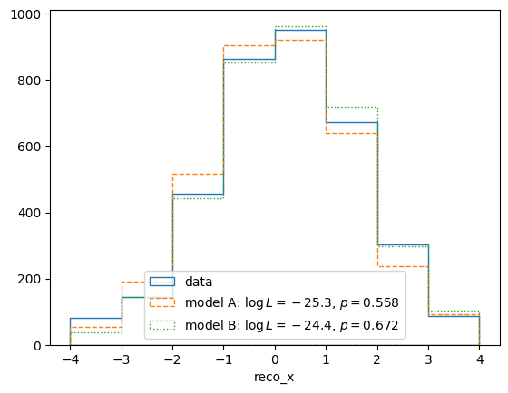

.. _example02:

===============================
Example 02 -- Simple model fits
===============================

Aims
====

*   Create a :class:`.LikelihoodCalculator` with the response matrix
    and experiment data
*   Calculate likelihoods of model predictions
*   Create a :class:`.HypothesisTester` and calculate p-values
*   Fit parameters and calculate p-values of composite hypotheses
*   Construct confidence intervals of parameters of composite hypotheses

Instructions
============

The calculation of likelihoods and p-values is handled by the classes in the
:mod:`.likelihood` module::

    from six import print_
    import numpy as np
    from remu import binning
    from remu import plotting
    from remu import likelihood

Some calculations handled in this module can be parallelized by setting the
``mapper`` function to something that uses parallel processes or threads, e.g.
the map function of a :class:`multiprocess.Pool` object::

    from multiprocess import Pool
    pool = Pool(8)
    likelihood.mapper = pool.map

This is completely optional, but can speed up the calculation of p-values
considerably. Please not the use of the ``multiprocess`` package, instead of
Python's native ``multiprocessing``. The latter does not support the pickling
of arbitrary functions, so it does not work.

First we will create :class:`.DataModel` and :class:`.ResponseMatrixPredictor`
objects from the information of the previous examples::

    response_matrix = "../01/response_matrix.npz"

    with open("../01/reco-binning.yml", 'rt') as f:
        reco_binning = binning.yaml.full_load(f)
    with open("../01/optimised-truth-binning.yml", 'rt') as f:
        truth_binning = binning.yaml.full_load(f)

    reco_binning.fill_from_csv_file("../00/real_data.txt")
    data = reco_binning.get_entries_as_ndarray()
    data_model = likelihood.PoissonData(data)
    matrix_predictor = likelihood.ResponseMatrixPredictor(response_matrix)

The data model knows how to compare event rate predictions to the data and
calculate the respective likelihoods, in this case using Poisson statistics.
The matrix predictor contains the information of the previously built response
matrix and is used to predict reco-space event rates from truth-space event
rates. These two can now be combined into a :class:`.LikelihoodCalculator` and
:class:`.HypothesisTester`::

    calc = likelihood.LikelihoodCalculator(data_model, matrix_predictor)
    test = likelihood.HypothesisTester(calc)

Likelihood calculators are in charge of computing likelihoods of parameter
sets. In this case, it will calculate the likelihoods of truth-space
event-rates, as that is what the predictor is expecting as parameters.
Hypothesis testers use the likelihood calculator to do statistical tests and
calculate p-values.

Now we need some models to test against the data. We will use the models A and
B of the previous steps, but we will turn them into area-normalised templates::

    truth_binning.fill_from_csv_file("../00/modelA_truth.txt")
    modelA = truth_binning.get_values_as_ndarray()
    modelA /= np.sum(modelA)

    truth_binning.reset()
    truth_binning.fill_from_csv_file("../00/modelB_truth.txt")
    modelB = truth_binning.get_values_as_ndarray()
    modelB /= np.sum(modelB)

Let us calculate some likelihoods and p-values with these templates, assuming
total of 1000 expected events in the truth space (i.e. before efficiency
effects)::

    print_(calc(modelA*1000))
    print_(test.likelihood_p_value(modelA*1000))
    print_(calc(modelB*1000))
    print_(test.likelihood_p_value(modelB*1000))

.. include:: simple_hypotheses.txt
    :literal:

The exact results may vary due to statistical fluctuations. Especially the
p-values are calculated by generating random data sets assuming the tested
model is true. The fraction of data sets with a worse likelihood than the
actual measured one is the p-value. Depending on the required confidence level,
we could exclude the "1000*A" hypothesis, while the "1000*B" hypothesis is more
compatible with the data.

Models that predict the true distribution of events usually have some free
parameters. For example we could assume that the shapes of models A and B are
well motivated but the total number of events is not well predicted. To test
these more flexible models, we can create predictors that take the free
parameters of the models as inputs and predict event rates in truth space.
By composing (i.e. "chaining") these predictors to the matrix predictor,
we can then build a likelihood calculator that takes these parameters as
inputs directly::

    modelA_shape = likelihood.TemplatePredictor([modelA])
    modelA_reco_shape = matrix_predictor.compose(modelA_shape)
    calcA = likelihood.LikelihoodCalculator(data_model, modelA_reco_shape)

This example uses the :class:`.TemplatePredictor` class, which takes a list of
templates as its initialisation parameter and creates a predictor with one
template weight parameter per template. Since we only provide one template
here, it only takes one parameter.

We can now do a maximum likelihood fit with the model, using a
:class:`.BasinHoppingMaximiser`::

    maxi = likelihood.BasinHoppingMaximizer()
    retA = maxi(calcA)
    print_(retA)

.. include:: modelA_fit.txt
    :literal:

The parameter values of the maximum likelihood solution are returned as
``ret.x``. The actual maximum log likelihood is stored in
``ret.log_likelihood``. The other properties of the returned object show the
status of the optimisation and are not important for this example.

Instead of composing the predictors and building a new likelihood calculator
with the result, it is also possible to directly compose the model predictor
with the likelihood calculator::

    modelB_shape = likelihood.TemplatePredictor([modelB])
    calcB = calc.compose(modelB_shape)
    retB = maxi(calcB)
    print_(retB)

.. include:: modelB_fit.txt
    :literal:

The maximum likelihood solutions for model A shows a lower number of events
than that of model B. This is due to the higher average efficiency of
reconstructing the events of model A, i.e. their distribution in ``y``. The
maximum log likelihood of model B is higher than for model A. So model B is
able to describe the given data better than model A. This is also reflected in
the p-values::

    testA = likelihood.HypothesisTester(calcA, maximizer=maxi)
    testB = likelihood.HypothesisTester(calcB, maximizer=maxi)
    print_(testA.max_likelihood_p_value())
    print_(testB.max_likelihood_p_value())

.. include:: fit_p-values.txt
    :literal:

Here we explicitly told the hypothesis testers which maximiser to use, but this
is optional.

Again the p-value is calculated from randomly generated data sets assuming the
given model is true. This time it is the ratio of data sets that yield a worse
*maximum* likelihood though. This means a fit is performed for each mock data
set.

We can also take a qualitative look at the fit of data and the two models by
plotting the result in reco space::

    pltr = plotting.get_plotter(reco_binning)
    pltr.plot_entries(label='data', hatch=None)
    modelA_reco, modelA_weights = modelA_reco_shape(retA.x)
    modelA_logL = calcA(retA.x)
    modelA_p = testA.likelihood_p_value(retA.x)
    modelB_reco, modelB_weights = calcB.predictor(retB.x)
    modelB_logL = calcB(retB.x)
    modelB_p = testB.likelihood_p_value(retB.x)
    pltr.plot_array(modelA_reco,
        label='model A: $\log L=%.1f$, $p=%.3f$'%(modelA_logL, modelA_p),
        hatch=None, linestyle='dashed')
    pltr.plot_array(modelB_reco,
        label='model B: $\log L=%.1f$, $p=%.3f$'%(modelB_logL, modelB_p),
        hatch=None, linestyle='dotted')
    pltr.legend(loc='lower center')
    pltr.savefig("reco-comparison.png")

The p-value shown in this plot is again the :meth:`.likelihood_p_value` (as
opposed to the :meth:`.max_likelihood_p_value`). This is a better
representation of the goodness of fit of the maximum likelihood solution,
roughly equivalent to checking for a "chi-square" close to the number of bins.

The return values of the predictors are formated to accomodate multiple
weighted predictions per set of parameters, i.e. systematic incertainties. We
can ignore the weights for now.

Usually there is more than one template to be fitted to the data. Let's see
what happens if we allow combinations of model A and B::

    mix_model = likelihood.TemplatePredictor([modelA, modelB])
    calc_mix = calc.compose(mix_model)
    ret = maxi.maximize_log_likelihood(calc_mix)
    print_(ret)

.. include:: mix_model_fit.txt
    :literal:

::

    test = likelihood.HypothesisTester(calc_mix)
    print_(test.max_likelihood_p_value())

.. include:: mix_model_p_value.txt
    :literal:

The two parameters of this new combined model are the weights of model A and B
respectively. This allows a contribution of model A in the maximum likelihood
solution.

It might be useful to calculate a confidence interval for a parameter embedded
in a larger hypothesis with more parameters. This can be done by fixing that
parameter at different values (reducing the number of free parameters) and
calculating the likelihood ratio of this new embedded hypothesis and the
embedding original hypothesis. Comparing this likelihood ratio with the
expected distribution of likelihood ratios assuming the embedded hypothesis is
true yields p-values that can be used to construct the confidence interval::

    p_values = []
    A_values = np.linspace(0, 1000, 11)
    for A in A_values:
        p = test.max_likelihood_ratio_p_value((A,None))
        print_(A, p)
        p_values.append(p)

Calculating these might take a while. The method
:meth:`.max_likelihood_ratio_p_value` fixes the specified parameters and
generates toy data sets at the best fit point of the remaining parameters. It
then computes the maximum likelihoods for both the fixed and unfixed version of
the predictors for all toy data sets. The fraction of toy data sets with an
equal or worse maximum likelihood ratio then the real data is the p-value.

This p-value is sometimes called the “profile plug-in p-value”, as one “plugs
in” the maximum likelihood estimate of the hypothesis' (nuisance) parameters to
generate the toy data and calculate the p-value. It’s coverage properties are
not exact, so care has to be taken to make sure it performs as expected (e.g.
by testing it with simulated data).

In the limit of "large statistics", the maximum log likelihood ratio should be
distributed like a chi-square distribution, according to Wilks' theorem. This
can be used to speed up the calculation of p-values considerably, as it skips
the generation of fit to toy data sets::

    wilks_p_values = []
    fine_A_values = np.linspace(0, 1000, 100)
    for A in fine_A_values:
        p = test.wilks_max_likelihood_ratio_p_value((A,None))
        print_(A, p)
        wilks_p_values.append(p)

This can then be plotted with your usual plotting libraries::

    from matplotlib import pyplot as plt
    fig, ax = plt.subplots()
    ax.set_xlabel("Model A weight")
    ax.set_ylabel("p-value")
    ax.plot(A_values, p_values, label="Profile plug-in")
    ax.plot(fine_A_values, wilks_p_values, label="Wilks")
    ax.axvline(ret.x[0], color='k', linestyle='solid')
    ax.axhline(0.32, color='k', linestyle='dashed')
    ax.axhline(0.05, color='k', linestyle='dashed')
    ax.legend(loc='best')
    fig.savefig("p-values.png")

.. image:: p-values.png

The confidence interval is the region of the parameter space with a p-value
over the desired test significance. The maximum likelihood solution is shown as
vertical line. Please note that this assumes that the full hypothesis with no
fixed parameters is true, i.e. that some combination of model A and model B
templates actually describes reality.
