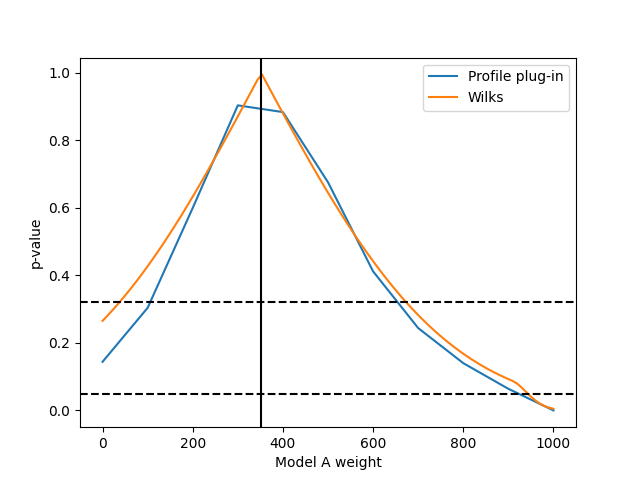

===============================
Example 02 -- Simple model fits
===============================

Aims
====

*   Create a :class:`.LikelihoodMachine` with the response matrix
    and experiment data
*   Calculate likelihoods and p-values of simple model hypotheses
*   Fit parameters and calculate p-values of composite hypotheses
*   Construct confidence intervals of parameters of composite hypotheses

Instructions
============

The calculation of likelihoods and p-values is handled by
:class:`.LikelihoodMachine` objects. They are created with the actual data, the
response matrix, and the information about the limits of the validity of the
matrix::

    from six import print_
    import numpy as np
    from matplotlib import pyplot as plt
    from remu import binning
    from remu import likelihood

    response_matrix = np.load("../01/response_matrix.npy")
    generator_truth = np.load("../01/generator_truth.npy")

    with open("../01/reco-binning.yml", 'rt') as f:
        reco_binning = binning.yaml.load(f)
    with open("../01/optimised-truth-binning.yml", 'rt') as f:
        truth_binning = binning.yaml.load(f)

    reco_binning.fill_from_csv_file("../00/real_data.txt")
    data = reco_binning.get_entries_as_ndarray()

    lm = likelihood.LikelihoodMachine(data, response_matrix, truth_limits=generator_truth, limit_method='prohibit')

Now we need some models to test against the data. We will use the models A and
B of the previous steps, but we will turn them into area-normalised templates::

    truth_binning.fill_from_csv_file("../00/modelA_truth.txt")
    modelA = truth_binning.get_values_as_ndarray()
    modelA /= np.sum(modelA)
    truth_binning.reset()
    truth_binning.fill_from_csv_file("../00/modelB_truth.txt")
    modelB = truth_binning.get_values_as_ndarray()
    modelB /= np.sum(modelB)

Let us calculate some likelihoods and p-values, a total of 1000 expected events in the truth space (i.e. before efficiency effects)::

    print_(lm.log_likelihood(modelA*1000))
    print_(lm.likelihood_p_value(modelA*1000))
    print_(lm.log_likelihood(modelB*1000))
    print_(lm.likelihood_p_value(modelB*1000))

.. include:: simple_hypotheses.txt
    :literal:

The exact results may vary due to statistical fluctuations. Especially the
p-values are calculated by generating random data sets assuming the tested
model is true. The fraction of data sets with a worse likelihood than the
actual measured one is the p-value. Depending on the required confidence level,
we could exclude the "1000*A" hypothesis, while the "1000*B" hypothesis is more
compatible with the data.

Models that predict the true distribution of events usually have some free
parameters. For example we could assume that the shapes of models A and B are
well motivated but the total number of events is not well predicted. To test
these more flexible models, we can use the :class:`.CompositeHypothesis`
objects. They take a set of parameters and turn it into truth space
predictions. The :class:`.TemplateHypothesis` is a special case of this. It
takes one or more templates and combines them linearly for the final truth
value prediction. The parameters of the :class:`.TemplateHypothesis` are the
linear coefficients, or weights, of the different templates::

    modelA_shape = likelihood.TemplateHypothesis([modelA])
    modelB_shape = likelihood.TemplateHypothesis([modelB])

We can now do a maximum likelihood fit with the two models::

    retA = lm.max_log_likelihood(modelA_shape)
    print_(retA)

.. include:: modelA_fit.txt
    :literal:

The parameter values of the maximum likelihood solution are returned as
``ret.x``. The actual maximum log likelihood is stored in ``ret.L``. The other
properties of the returned object show the status of the optimisation and are
not important for this example. And here is the same for model B::

    retB = lm.max_log_likelihood(modelB_shape)
    print_(retB)

.. include:: modelB_fit.txt
    :literal:

The maximum likelihood solutions for model A shows a lower number of events
than that of model B. This is due to the higher average efficiency of
reconstructing the events of model A, i.e. their distribution in ``y``. The
maximum log likelihood of model B is higher than for model A. So model B is
able to describe the given data better than model A. This is also reflected in
the p-values::

    print_(lm.max_likelihood_p_value(modelA_shape, nproc=4))
    print_(lm.max_likelihood_p_value(modelB_shape, nproc=4))

.. include:: fit_p-values.txt
    :literal:

Again the p-value is calculated from randomly generated data sets assuming the
given model is true. This time it is the ratio of data sets that yield a worse
*maximum* likelihood though. This means a fit is performed for each mock data
set. To speed up the calculation, the parameter `nproc` was used to specify
that 4 processes should be used in parallel.

We can also take a qualitative look at the fit of data and the two models by
plotting the result in reco space::

    figax = reco_binning.plot_values(None, kwargs1d={'label': 'data', 'color': 'k'})
    modelA_reco = response_matrix.dot(modelA_shape.translate(retA.x))
    modelB_reco = response_matrix.dot(modelB_shape.translate(retB.x))
    reco_binning.plot_ndarray(None, modelA_reco, kwargs1d={'label': 'model A', 'color': 'b'}, sqrt_errors=True, figax=figax)
    reco_binning.plot_ndarray("reco-comparison.png", modelB_reco, kwargs1d={'label': 'model B', 'color': 'r'}, sqrt_errors=True, figax=figax)

.. image:: reco-comparison.png

Here the models' expectation values are plotted with ``sqrt(n)`` error bars as
an approximation of their expected data ranges. The actual likelihood
calculation uses the correct Poisson probabilities. The models' data points
are shifted horizontally for readability.

Usually there is more than one template to be fitted to the data. Let's see
what happens if we allow combinations of model A and B::

    mix_model = likelihood.TemplateHypothesis([modelA, modelB])
    ret = lm.max_log_likelihood(mix_model)
    print_(ret)

.. include:: mix_model_fit.txt
    :literal:

::

    print_(lm.max_likelihood_p_value(mix_model, nproc=4))

.. include:: mix_model_p_value.txt
    :literal:

Now the two parameters are the weights of model A and B respectively. In this
combined model, there might be a small contribution of model A in the maximum
likelihood solution.

It might be useful to calculate a confidence interval for a parameter embedded
in a larger hypothesis with more parameters. This can be done by fixing that
parameter at different values (reducing the number of free parameters) and
calculating the likelihood ratio of this new embedded hypothesis and the
embedding original hypothesis. Comparing this likelihood ratio with the
expected distribution of likelihood ratios assuming the embedded hypothesis is
true yields p-values that can be used to construct the confidence interval::

    p_values = []
    A_values = np.linspace(0, 1000, 11)
    for A in A_values:
        fixed_model = mix_model.fix_parameters((A, None))
        p = lm.max_likelihood_ratio_p_value(fixed_model, mix_model, nproc=4)
        p_values.append(p)

    fig, ax = plt.subplots()
    ax.set_xlabel("Model A weight")
    ax.set_ylabel("p-value")
    ax.plot(A_values, p_values)
    ax.axvline(ret.x[0], color='k', linestyle='solid')
    ax.axhline(0.32, color='k', linestyle='dashed')
    ax.axhline(0.05, color='k', linestyle='dashed')
    fig.savefig("p-values.png")

Calculating these p-values might take a while. The confidence interval is the
region of the parameter space with a p-value under the desired test
significance. The maximum likelihood solution is shown as vertical line.
