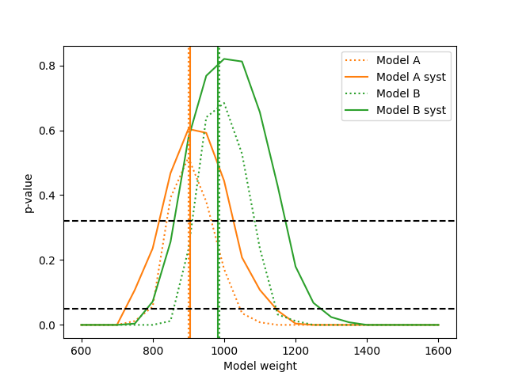

.. _example03:

====================================
Example 03 -- Detector uncertainties
====================================

Aims
====

*   Generate random detector response variations
*   Include detector uncertainties in the response matrix by using a
    :class:`.ResponseMatrixArrayBuilder`
*   Include statistical uncertainties by generating randomly varied matrices
*   Use varied response matrices for fits and hypothesis tests

Instructions
============

The properties of experimental setups are usually only known to a finite
precision. The remaining uncertainty on these properties, and thus the
uncertainty on the detector response to true events, must be reflected in the
response matrix.

We can create an event-by-event variation of the detector response with the
provided script::

    $ ../simple_experiment/vary_detector.py ../00/modelA_data.txt modelA_data.txt
    $ ../simple_experiment/vary_detector.py ../00/modelB_data.txt modelB_data.txt

It creates 100 randomly generated variations of the simulated detector and
varies the simulation that was created in example 00 accordingly. Each
variation describes one possible real detector and is often called a "toy
variation" or a "universe".

Events are varied in two ways: The values of reconstructed variables can be
different for each toy, and each event can get assigned a weight. The former
can be used to cover uncertainties in the detector precision and accuracy,
while the latter is a simple way to deal with uncertainties in the overall
probability of reconstructing an event.

In this case, the values of the reconstructed ``reco_x`` are varied and saved
as ``reco_x_0`` to ``reco_x_99``. The detection efficiency is also varied and
the ratio of the events nominal efficiency and the efficiency assuming the toy
detector stored as ``weight_0`` up to ``weight_99``. Let us plot the different
reconstructed distributions we get from the toy variations:

.. include:: plot_data.py
    :literal:

.. image:: data.png

Here we simply plot one histogram for each toy data set with a low alpha value
(i.e with high transparency), as well as a solid histogram for the mean values.
Also we scaled the model predictions by a factor 10, simply because that makes
"experiment running time" of the model predictions correspond to the data.

We are using a few specific arguments to the ``fill_from_csv_file`` method:

``weightfield``
    Tells the object which field to use as the weight of the events.
    Does not need to follow any naming conventions.
    Here we tell it to use the field corresponding to each toy.

``rename``
    The binning of the response matrix expects a variable called ``reco_x``.
    This variable is not present in the varied data sets. Here we can specify a
    dictionary with columns in the data that will be renamed before filling the
    matrix.

``buffer_csv_files``
    Reading a CSV file from disk and turning it into an array of floating point
    values takes quite a bit of time. We can speed up the process by buffering
    the intermediate array on disk. This means the time consuming parsing of a
    text file only has to happen once per CSV file.

ReMU handles the detector uncertainties by building a response matrix for each
toy detector separately. These matrices are then used in parallel to calculate
likelihoods. In the end, the marginal (i.e. average) likelihood is used as the
final answer. Some advanced features of ReMU (like sparse matrices, or nuisance
bins) require quite a bit of book-keeping to make the toy matrices behave
consistently and as expected. This is handled by the
:class:`.ResponseMatrixArrayBuilder`::

    from remu import binning
    from remu import migration

    builder = migration.ResponseMatrixArrayBuilder(1)

Its only argument is the number of randomly drawn statistical variations per
toy response matrix. The number of simulated events that are used to build the
response matrix influences the statistical uncertainty of the response matrix
elements. This can be seen as an additional "systematic" uncertainty of the
detector response. By generating randomly fluctuated response matrices from
the toy matrices, it can be handled organically with the other systematics.
In this case we generate 1 randomly varied matrix per toy matrix, yielding a
total of 100 matrices in the end.

The toy matrices themselves are built like the nominal matrix in the previous
examples and then added to the builder::

    with open("../01/reco-binning.yml", 'rt') as f:
        reco_binning = binning.yaml.full_load(f)
    with open("../01/optimised-truth-binning.yml", 'rt') as f:
        truth_binning = binning.yaml.full_load(f)

    resp = migration.ResponseMatrix(reco_binning, truth_binning)

    n_toys = 100
    for i in range(n_toys):
        resp.reset()
        resp.fill_from_csv_file(["modelA_data.txt", "modelB_data.txt"],
            weightfield='weight_%i'%(i,), rename={'reco_x_%i'%(i,): 'reco_x'},
            buffer_csv_files=True)
        resp.fill_up_truth_from_csv_file(
            ["../00/modelA_truth.txt", "../00/modelB_truth.txt"],
            buffer_csv_files=True)
        builder.add_matrix(resp)

.. note::
    The toy variations in ``modelA_data.txt`` and ``modelB_data.txt``
    must be identical! Otherwise it is not possible to fill the toy matrices with
    events from both files. It would mix events reconstructed with different
    detectors.

This might create some warnings like this::

    UserWarning: Filled-up values are less than the original filling in 1 bins. This should not happen!
      return self._replace_smaller_truth(new_truth_binning)

This occurs when events in a bin with already high efficiency are re-weighted
to give the impression of an efficiency greater than 100%. If it does not
happen too often, it can be ignored.

The builder generates the actual array of floating point numbers as soon as the
:class:`.ResponseMatrix` object is added. It retains no connection to the object
itself.

Now we just need to save the set of response matrices for later use in the
likelihood fits::

    builder.export("response_matrix.npz")

The :class:`.LikelihoodCalculator` is created just like in the previous example::

    from six import print_
    import numpy as np
    from matplotlib import pyplot as plt
    from remu import binning
    from remu import plotting
    from remu import likelihood
    from multiprocess import Pool
    pool = Pool(8)
    likelihood.mapper = pool.map

    with open("../01/reco-binning.yml", 'rt') as f:
        reco_binning = binning.yaml.full_load(f)
    with open("../01/optimised-truth-binning.yml", 'rt') as f:
        truth_binning = binning.yaml.full_load(f)

    reco_binning.fill_from_csv_file("../00/real_data.txt")
    data = reco_binning.get_entries_as_ndarray()
    data_model = likelihood.PoissonData(data)

    # No systematics LikelihoodCalculator
    response_matrix = "../01/response_matrix.npz"
    matrix_predictor = likelihood.ResponseMatrixPredictor(response_matrix)
    calc = likelihood.LikelihoodCalculator(data_model, matrix_predictor)

    # Systematics LikelihoodCalculator
    response_matrix_syst = "response_matrix.npz"
    matrix_predictor_syst = likelihood.ResponseMatrixPredictor(response_matrix_syst)
    calc_syst = likelihood.LikelihoodCalculator(data_model, matrix_predictor_syst)

To show the influence of the systematic uncertainties, we create two
:class:`.LikelihoodCalculator` objects here. One with the non-varied detector
response and one with the set of systematically varied responses.

Now we can test some models against the data, just like in the previous
example::

    truth_binning.fill_from_csv_file("../00/modelA_truth.txt")
    modelA = truth_binning.get_values_as_ndarray()
    modelA /= np.sum(modelA)
    truth_binning.reset()
    truth_binning.fill_from_csv_file("../00/modelB_truth.txt")
    modelB = truth_binning.get_values_as_ndarray()
    modelB /= np.sum(modelB)
    maxi = likelihood.BasinHoppingMaximizer()

    modelA_shape = likelihood.TemplatePredictor([modelA])
    calcA = calc.compose(modelA_shape)
    retA = maxi(calcA)
    print_(retA)

.. include:: modelA_fit.txt
    :literal:

::

    calcA_syst = calc_syst.compose(modelA_shape)
    retA_syst = maxi(calcA_syst)
    print_(retA_syst)

.. include:: modelA_fit_syst.txt
    :literal:

::

    modelB_shape = likelihood.TemplatePredictor([modelB])
    calcB = calc.compose(modelB_shape)
    retB = maxi(calcB)
    print_(retB)

.. include:: modelB_fit.txt
    :literal:

::

    calcB_syst = calc_syst.compose(modelB_shape)
    retB_syst = maxi(calcB_syst)
    print_(retB_syst)

.. include:: modelB_fit_syst.txt
    :literal:

Let us take another look at how the fitted templates and the data compare in
reco space. This time we are going to use `ReMU`'s built in functions to plot a
set of bin contents, i.e. the set of model predictions varied by the detector
systematics::

    pltr = plotting.get_plotter(reco_binning)
    pltr.plot_values(edgecolor='C0', label='data', hatch=None, linewidth=2.)
    modelA_reco, modelA_weights = calcA.predictor(retA.x)
    modelB_reco, modelB_weights = calcB.predictor(retB.x)
    modelA_syst_reco, modelA_syst_weights = calcA_syst.predictor(retA.x)
    modelB_syst_reco, modelB_syst_weights = calcB_syst.predictor(retB.x)
    pltr.plot_array(modelA_reco, label='model A', edgecolor='C1', hatch=None)
    pltr.plot_array(modelA_syst_reco, label='model A syst', edgecolor='C1',
        hatch=r'//', stack_function=0.68)
    pltr.plot_array(modelB_reco, label='model B', edgecolor='C2', hatch=None)
    pltr.plot_array(modelB_syst_reco, label='model B syst', edgecolor='C2',
        hatch=r'\\', stack_function=0.68)
    pltr.legend()
    pltr.savefig('reco-comparison.png')

.. image:: reco-comparison.png

The ``modelX_syst_reco`` arrays now contain 100 different predictions,
corresponding to the 100 detector variations. The parameter ``stac_function ==
0.68`` tells the plotter to draw the area of the central 68% of the range of
predictions.

And of course we can compare the p-values of the two fitted models assuming the
nominal detector response::

    testA = likelihood.HypothesisTester(calcA)
    testB = likelihood.HypothesisTester(calcB)
    print_(testA.max_likelihood_p_value())
    print_(testB.max_likelihood_p_value())

.. include:: fit_p-values.txt
    :literal:

As well as the p-values yielded when taking the systematic uncertainties into account::

    testA_syst = likelihood.HypothesisTester(calcA_syst)
    testB_syst = likelihood.HypothesisTester(calcB_syst)
    print_(testA_syst.max_likelihood_p_value())
    print_(testB_syst.max_likelihood_p_value())

.. include:: fit_p-values_syst.txt
    :literal:

We can construct confidence intervals on the template weights of the models
using the maximum likelihood p-value just like before::

    p_values_A = []
    p_values_B = []
    p_values_A_syst = []
    p_values_B_syst = []
    values = np.linspace(600, 1600, 21)
    for v in values:
        A = testA.max_likelihood_p_value([v])
        A_syst = testA_syst.max_likelihood_p_value([v])
        B = testB.max_likelihood_p_value([v])
        B_syst = testB_syst.max_likelihood_p_value([v])
        print_(v, A, A_syst, B, B_syst)
        p_values_A.append(A)
        p_values_B.append(B)
        p_values_A_syst.append(A_syst)
        p_values_B_syst.append(B_syst)

    fig, ax = plt.subplots()
    ax.set_xlabel("Model weight")
    ax.set_ylabel("p-value")
    ax.plot(values, p_values_A, label="Model A", color='C1', linestyle='dotted')
    ax.plot(values, p_values_A_syst, label="Model A syst", color='C1', linestyle='solid')
    ax.plot(values, p_values_B, label="Model B", color='C2', linestyle='dotted')
    ax.plot(values, p_values_B_syst, label="Model B syst", color='C2', linestyle='solid')
    ax.axvline(retA.x[0], color='C1', linestyle='dotted')
    ax.axvline(retA_syst.x[0], color='C1', linestyle='solid')
    ax.axvline(retB.x[0], color='C2', linestyle='dotted')
    ax.axvline(retB_syst.x[0], color='C2', linestyle='solid')
    ax.axhline(0.32, color='k', linestyle='dashed')
    ax.axhline(0.05, color='k', linestyle='dashed')
    ax.legend(loc='best')
    fig.savefig("p-values.png")

The "fixed" models have no free parameters here, making them degenerate. This
means using the :meth:`.max_likelihood_p_value` is equivalent to testing the
corresponding simple hypotheses using the :meth:`.likelihood_p_value`. No
actual maximisation is taking place. Note that the p-values for model A are
generally smaller than those for model B. This is consistent with previous
results showing that the data is better described by model B.

Finally, let us construct confidence intervals of the template weights,
*assuming that the corresponding model is correct*::

    p_values_A = []
    p_values_B = []
    p_values_A_syst = []
    p_values_B_syst = []
    values = np.linspace(600, 1600, 21)
    for v in values:
        A = testA.max_likelihood_ratio_p_value([v])
        A_syst = testA_syst.max_likelihood_ratio_p_value([v])
        B = testB.max_likelihood_ratio_p_value([v])
        B_syst = testB_syst.max_likelihood_ratio_p_value([v])
        print_(v, A, A_syst, B, B_syst)
        p_values_A.append(A)
        p_values_B.append(B)
        p_values_A_syst.append(A_syst)
        p_values_B_syst.append(B_syst)

    p_values_A_wilks = []
    p_values_B_wilks = []
    fine_values = np.linspace(600, 1600, 100)
    for v in fine_values:
        A = testA_syst.wilks_max_likelihood_ratio_p_value([v])
        B = testB_syst.wilks_max_likelihood_ratio_p_value([v])
        print_(v, A, B)
        p_values_A_wilks.append(A)
        p_values_B_wilks.append(B)

    fig, ax = plt.subplots()
    ax.set_xlabel("Model weight")
    ax.set_ylabel("p-value")
    ax.plot(values, p_values_A, label="Model A", color='C1', linestyle='dotted')
    ax.plot(values, p_values_A_syst, label="Model A syst", color='C1', linestyle='solid')
    ax.plot(fine_values, p_values_A_wilks, label="Model A Wilks", color='C1', linestyle='dashed')
    ax.plot(values, p_values_B, label="Model B", color='C2', linestyle='dotted')
    ax.plot(values, p_values_B_syst, label="Model B syst", color='C2', linestyle='solid')
    ax.plot(fine_values, p_values_B_wilks, label="Model B Wilks", color='C2', linestyle='dashed')
    ax.axvline(retA.x[0], color='C1', linestyle='dotted')
    ax.axvline(retA_syst.x[0], color='C1', linestyle='solid')
    ax.axvline(retB.x[0], color='C2', linestyle='dotted')
    ax.axvline(retB_syst.x[0], color='C2', linestyle='solid')
    ax.axhline(0.32, color='k', linestyle='dashed')
    ax.axhline(0.05, color='k', linestyle='dashed')
    ax.legend(loc='best')
    fig.savefig("ratio-p-values.png")

.. image:: ratio-p-values.png

Note that the p-values for both models go up to 1.0 here (within the
granularity of the parameter scan) and that the constructed confidence
intervals are very different from the ones before. This is because we are
asking a different question now. Before we asked the question "What is the
probability of getting a worse likelihood assuming that the tested
model-parameter is true?". Now we ask the question "What is the probability of
getting a worse best-fit likelihood ratio, assuming the tested model-parameter
is true?". Since the likelihood ratio is 1.0 at the best fit point and the
likelihood ratio of nested hypotheses is less than or equal to 1.0 by
construction, the p-value is 100% there.

The method :meth:`.wilks_max_likelihood_ratio_p_value` calculates the same
p-value as :meth:`.max_likelihood_ratio_p_value`, but does so assuming Wilks'
theorem holds. This does not require the generation of random data and
subsequent likelihood maximisations, so it is much faster.
