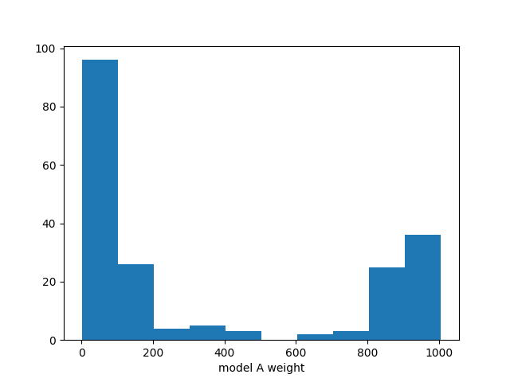
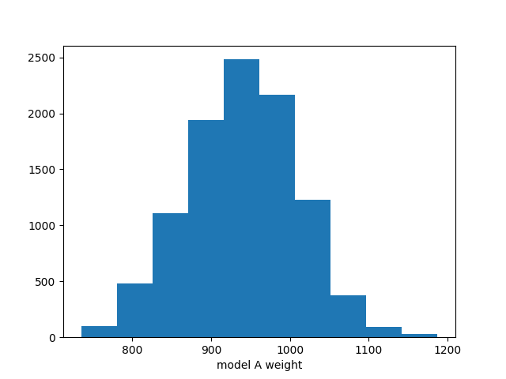
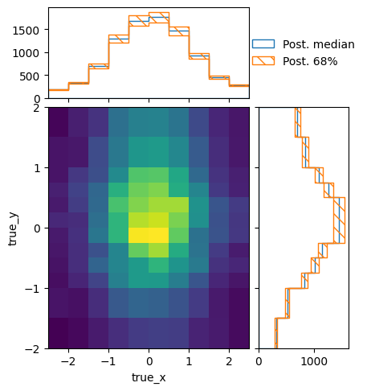
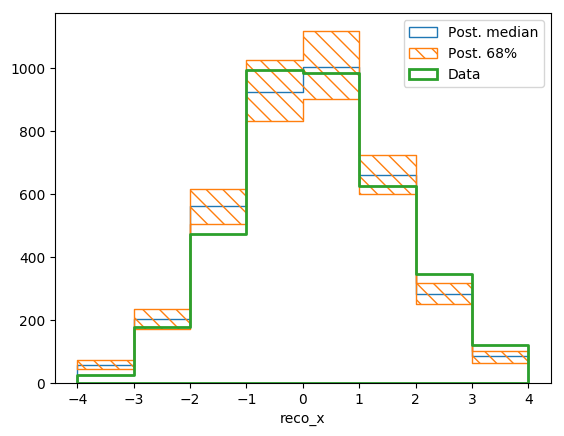
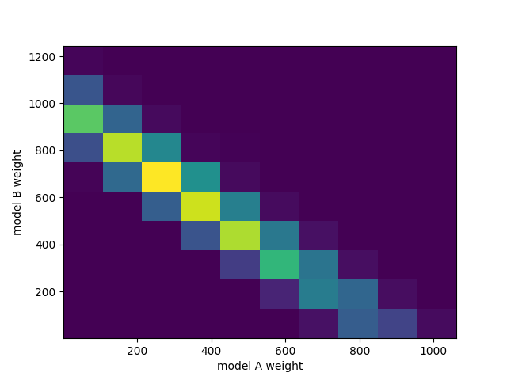
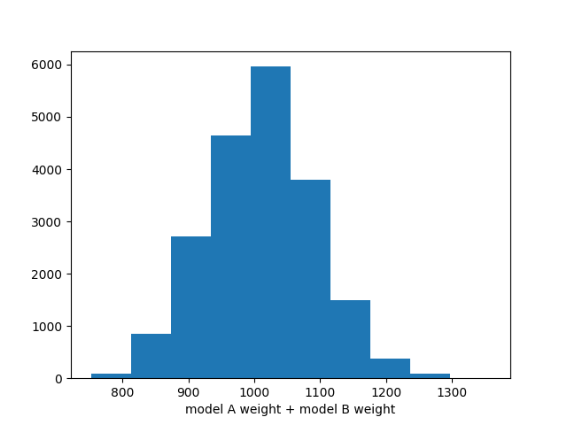

.. _example04:

======================================
Example 04 -- Markov Chain Monte Carlo
======================================

Aims
====

*   Use :class:`.LikelihoodCalculator` objects in a Marcov Chain Monte Carlo
    Sampling

Instructions
============

:class:`.LikelihoodCalculator` objects allow direct access to the likelihood
function of theoretical models given the measured data. As such they can easily
be used in Bayesian inference using Marcov Chain Monte Carlo (MCMC) methods.

ReMU has some built-in support to simplyfy the use of
:class:`.LikelihoodCalculator` objects with ``emcee``, a MCMC package for
python:

https://emcee.readthedocs.io/

Before we can use the MCMC, we have to create the response matrix,
:class:`.LikelihoodCalculator` objects, just like in the previous examples::

    import numpy as np
    from matplotlib import pyplot as plt
    from remu import binning
    from remu import plotting
    from remu import likelihood
    from remu import likelihood_utils
    import emcee

    with open("../01/reco-binning.yml", 'rt') as f:
        reco_binning = binning.yaml.full_load(f)
    with open("../01/optimised-truth-binning.yml", 'rt') as f:
        truth_binning = binning.yaml.full_load(f)

    reco_binning.fill_from_csv_file("../00/real_data.txt")
    data = reco_binning.get_entries_as_ndarray()
    data_model = likelihood.PoissonData(data)

    response_matrix = "../03/response_matrix.npz"
    matrix_predictor = likelihood.ResponseMatrixPredictor(response_matrix)
    calc = likelihood.LikelihoodCalculator(data_model, matrix_predictor)

    truth_binning.fill_from_csv_file("../00/modelA_truth.txt")
    modelA = truth_binning.get_values_as_ndarray()
    modelA /= np.sum(modelA)

    modelA_shape = likelihood.TemplatePredictor([modelA])
    calcA = calc.compose(modelA_shape)

Now we can create a sampler and inital guesses for the parameters
using the :mod:`.likelihood_utils` module::

    samplerA = likelihood_utils.emcee_sampler(calcA)
    guessA = likelihood_utils.emcee_initial_guess(calcA)

These can then be used to draw from the posterior distribution. Since the
likelihood function used here is not modified by a prior, this is equivalent to
using flat priors for the parameters. See the emcee documentation for details
about how to use these objects::

    state = samplerA.run_mcmc(guessA, 100)
    chain = samplerA.get_chain(flat=True)
    print(chain.shape)

.. include:: chain_shape.txt
    :literal:

Note that the number of data points is higher than the requested chain length.
This is due to the fact that ``emcee`` will sample multiple chains in parallel,
which get combined into one long chain when using the ``flat`` option. The
number of chains depends on the number of free parameters.

We can now plot the distribution of the template weight parameter::

    fig, ax = plt.subplots()
    ax.hist(chain[:,0])
    ax.set_xlabel("model A weight")
    fig.savefig("burn_short.png")

There clearly is something wrong with this distribution. The MCMC has not
converged yet. The authors of ``emcee`` suggest to use the autocorrelation time
as a measure of whether a chain has converged::

    try:
        tau = samplerA.get_autocorr_time()
        print(tau)
    except emcee.autocorr.AutocorrError as e:
        print(e)

.. include:: burn_short_tau.txt
    :literal:

So let us try again with a longer chain::

    samplerA.reset()
    state = samplerA.run_mcmc(guessA, 200*50)
    chain = samplerA.get_chain(flat=True)

    try:
        tau = samplerA.get_autocorr_time()
        print(tau)
    except emcee.autocorr.AutocorrError as e:
        print(e)

.. include:: burn_long_tau.txt
    :literal:

Now the chain is long enough and we can have another look at the distribution::

    fig, ax = plt.subplots()
    ax.hist(chain[:,0])
    ax.set_xlabel("model A weight")
    fig.savefig("burn_long.png")

.. image:: burn_long.png

Now we can discard these events and generate a new set from the last state of
the sampler::

    samplerA.reset()
    state = samplerA.run_mcmc(state, 100*50)
    chain = samplerA.get_chain(flat=True)

    try:
        tau = samplerA.get_autocorr_time()
        print(tau)
    except emcee.autocorr.AutocorrError as e:
        print(e)

.. include:: tauA.txt
    :literal:

::

    fig, ax = plt.subplots()
    ax.hist(chain[:,0])
    ax.set_xlabel("model A weight")
    fig.savefig("weightA.png")

We can also take a look at how these predictions look in truth and reco space::

    truth, _ = modelA_shape(chain)
    truth.shape = (np.prod(truth.shape[:-1]), truth.shape[-1])
    pltr = plotting.get_plotter(truth_binning)
    pltr.plot_array(truth, stack_function=np.median, label="Post. median", hatch=None)
    pltr.plot_array(truth, stack_function=0.68, label="Post. 68%", scatter=0)
    pltr.legend()
    pltr.savefig("truthA.png")

::

    reco, _ = calcA.predictor(chain)
    reco.shape = (np.prod(reco.shape[:-1]), reco.shape[-1])
    pltr = plotting.get_plotter(reco_binning)
    pltr.plot_array(reco, stack_function=np.median, label="Post. median", hatch=None)
    pltr.plot_array(reco, stack_function=0.68, label="Post. 68%")
    pltr.plot_array(data, label="Data", hatch=None, linewidth=2)
    pltr.legend()
    pltr.savefig("recoA.png")

All of this also works with more parameters, of course::

    truth_binning.reset()
    truth_binning.fill_from_csv_file("../00/modelB_truth.txt")
    modelB = truth_binning.get_values_as_ndarray()
    modelB /= np.sum(modelB)

    combined = likelihood.TemplatePredictor([modelA, modelB])
    calcC = calc.compose(combined)

    samplerC = likelihood_utils.emcee_sampler(calcC)
    guessC = likelihood_utils.emcee_initial_guess(calcC)

    state = samplerC.run_mcmc(guessC, 200*50)
    chain = samplerC.get_chain(flat=True)
    print(chain.shape)

.. include:: combined_chain_shape.txt
    :literal:

::

    try:
        tau = samplerC.get_autocorr_time()
        print(tau)
    except emcee.autocorr.AutocorrError as e:
        print(e)

.. include:: burn_combined_tau.txt
    :literal:

::

    samplerC.reset()
    state = samplerC.run_mcmc(state, 100*50)
    chain = samplerC.get_chain(flat=True)
    try:
        tau = samplerC.get_autocorr_time()
        print(tau)
    except emcee.autocorr.AutocorrError as e:
        print(e)

.. include:: combined_tau.txt
    :literal:

::

    fig, ax = plt.subplots()
    ax.hist2d(chain[:,0], chain[:,1])
    ax.set_xlabel("model A weight")
    ax.set_ylabel("model B weight")
    fig.savefig("combined.png")

::

    fig, ax = plt.subplots()
    ax.hist(np.sum(chain, axis=-1))
    ax.set_xlabel("model A weight + model B weight")
    fig.savefig("total.png")

