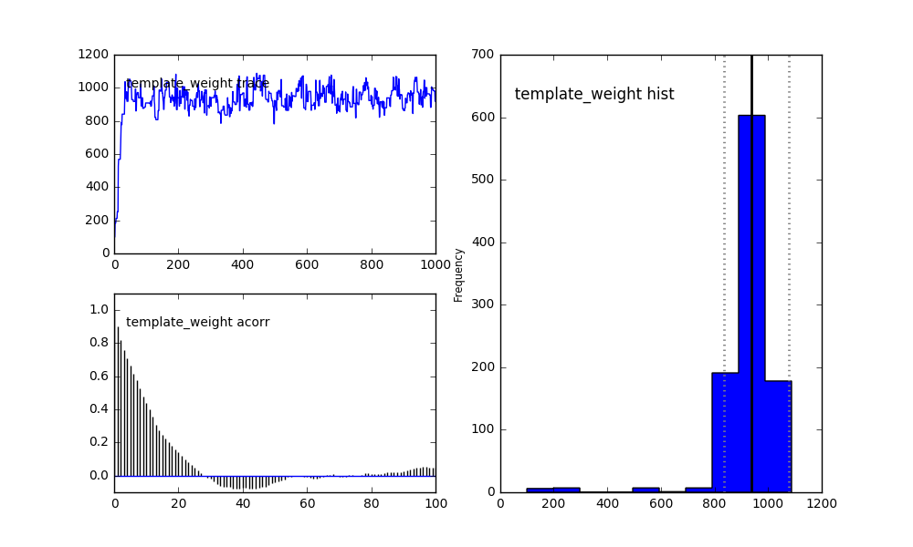
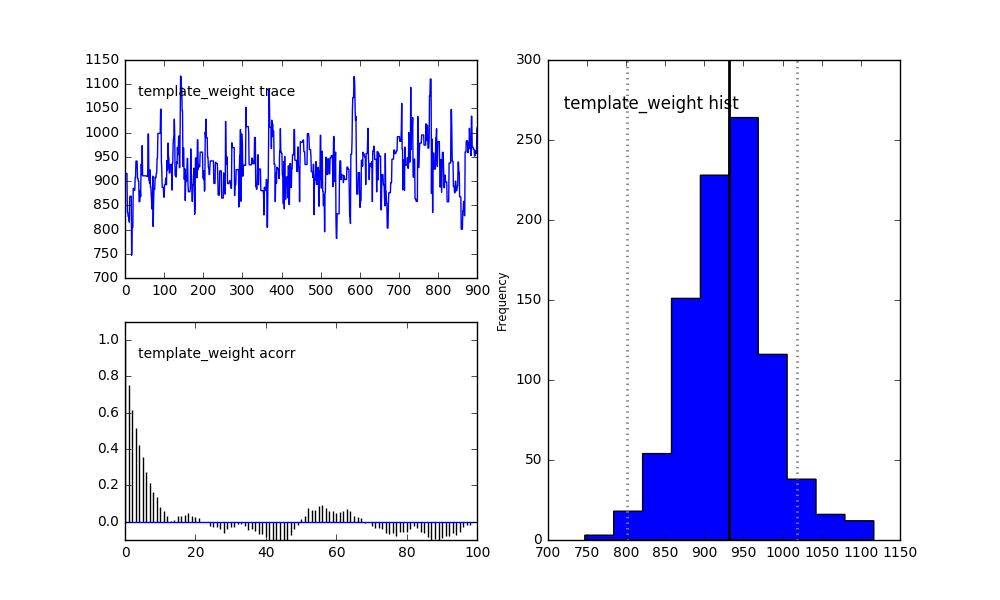
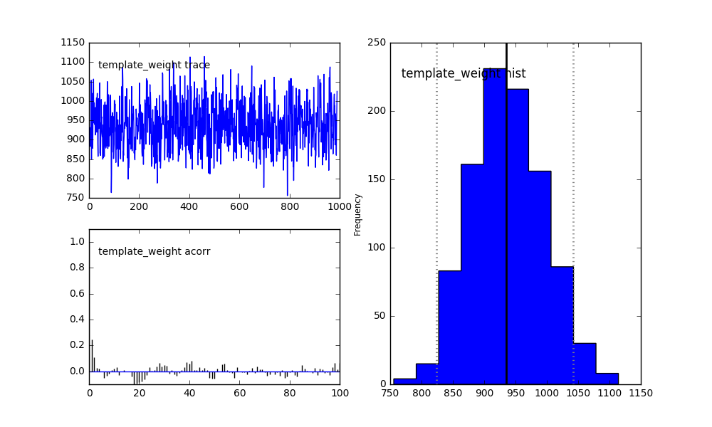
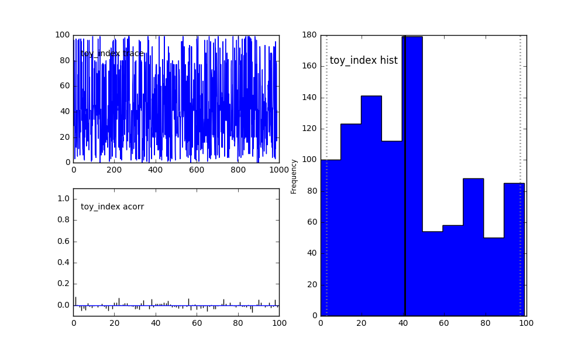
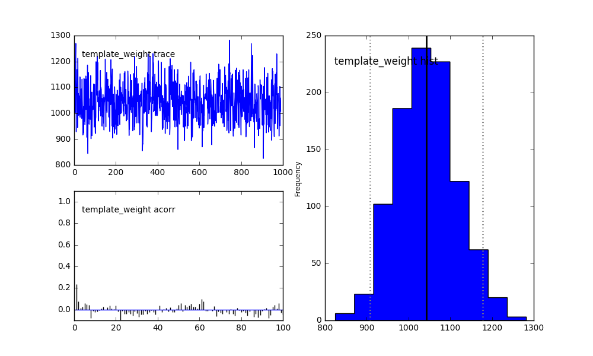
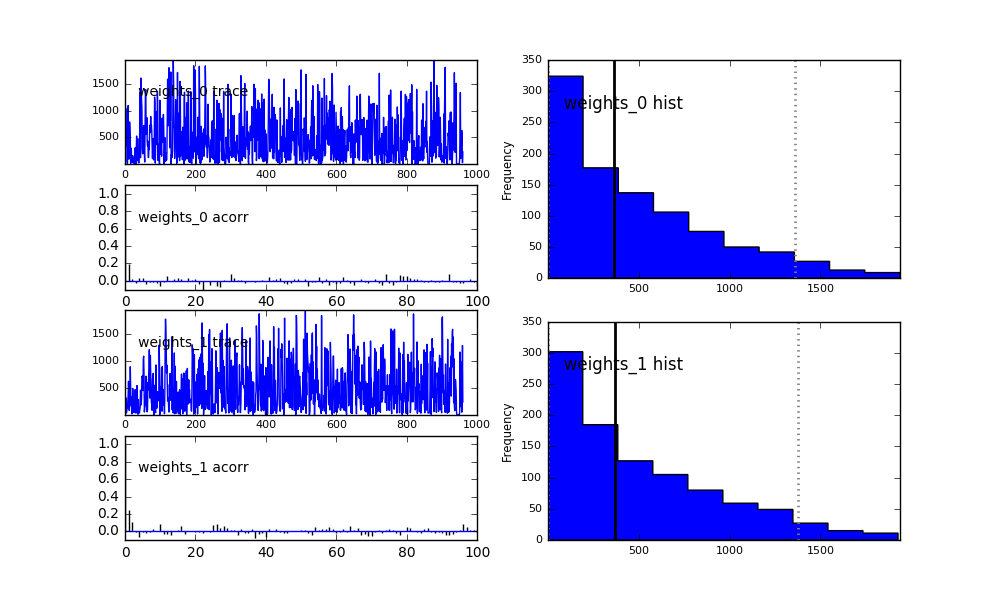
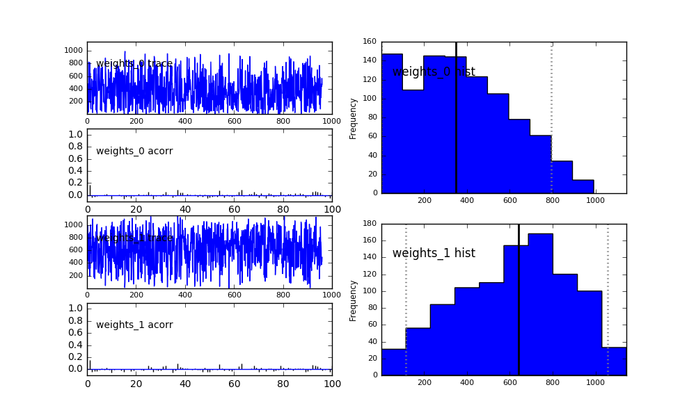
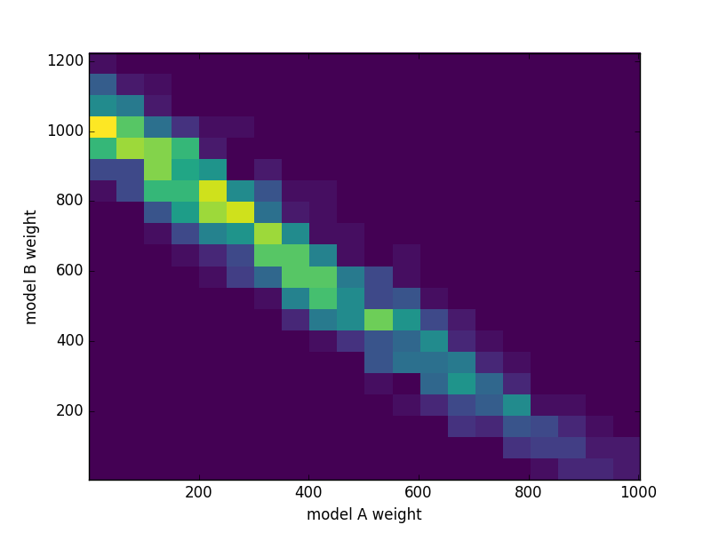
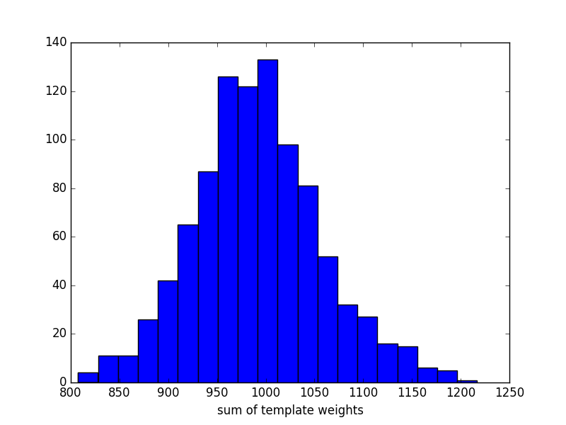
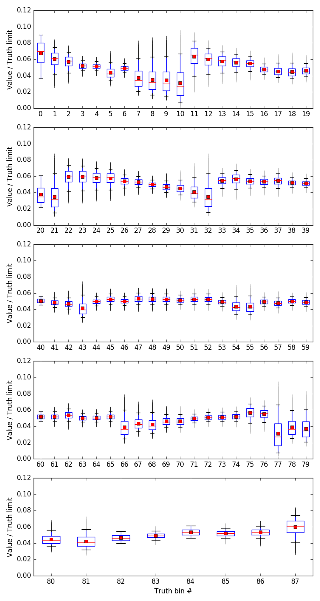

======================================
Example 04 -- Markov Chain Monte Carlo
======================================

Aims
====

*   Use :meth:`.mcmc` to create a PyMC MCMC object
*   Use Markov Chain Monte Carlo to create a posterior sample of
    :class:`.CompositeHypothesis` parameters
*   Compare two hypotheses using :meth:`.plr` to calculate the Posterior
    Distribution of the Likelihood Ratio
*   Use a :class:`.JeffreysPrior`

Instructions
============

ReMU has built-in support for generating Markov Chain Monte Carlo (MCMC)
samples using the PyMC package. This example will only give a basic example of
how to use this package in conjunction with ReMU. For detailed description of
PyMC's functionality, please refer to its documentation:

https://pymcmc.readthedocs.io/en/latest/

Before we can use the MCMC, we have to create the response matrix,
:class:`.LikelihoodMachine`, just like in the previous examples::

    from six import print_
    import numpy as np
    from matplotlib import pyplot as plt
    from remu import binning
    from remu import likelihood
    import pymc

    with open("../01/reco-binning.yml", 'rt') as f:
        reco_binning = binning.yaml.load(f)
    with open("../01/optimised-truth-binning.yml", 'rt') as f:
        truth_binning = binning.yaml.load(f)

    reco_binning.fill_from_csv_file("../00/real_data.txt")
    data = reco_binning.get_entries_as_ndarray()

    response_matrix = np.load("../03/response_matrix.npy")
    generator_truth = np.load("../03/generator_truth.npy")
    response_matrix.shape = (np.prod(response_matrix.shape[:-2]),) + response_matrix.shape[-2:]
    lm = likelihood.LikelihoodMachine(data, response_matrix, truth_limits=generator_truth, limit_method='prohibit')

Because the MCMC is a Bayesian method, we need to define prior probabilities
for the parameters of the :class:`.CompositeHypothesis` we want to test.
Explaining how to choose an "objective" prior (or defining what that even is),
is out of scope of this example. Let us just use a simple flat prior for the
template weights. Because we already know that the total number of events is
somewhere around 1000, we will constrain the prior to the interval (0, 2000)::

    truth_binning.fill_from_csv_file("../00/modelA_truth.txt")
    modelA = truth_binning.get_values_as_ndarray()
    modelA /= np.sum(modelA)
    truth_binning.reset()
    truth_binning.fill_from_csv_file("../00/modelB_truth.txt")
    modelB = truth_binning.get_values_as_ndarray()
    modelB /= np.sum(modelB)

    def flat_prior(value=100):
        if value >= 0 and value <= 2000:
            return 0
        else:
            return -np.inf

    modelA_shape = likelihood.TemplateHypothesis([modelA], parameter_priors=[flat_prior], parameter_names=["template_weight"])
    modelB_shape = likelihood.TemplateHypothesis([modelB], parameter_priors=[flat_prior], parameter_names=["template_weight"])

The function defining the prior must take one keyword argument ``value`` and
return the ``log`` of the prior probability. It must define a default value for
``value``, which must lie inside the allowed region of the parameter space. It
is used as the starting point for the MCMC evaluation. Since we are creating
:class:`.TemplateHypothesis` with only one template each, the parameter is only
a single floating point number: the template weight. If we used multiple
templates, the parameter would be a 1D array with all template weights.

With these :class:`.CompositeHypothesis` we can now create a :class:`MCMC`
object and sample the posterior distribution of the parameter (see PyMC
documentation)::

    mcmcA = lm.mcmc(modelA_shape)

    mcmcA.sample(iter=1000)
    pymc.Matplot.plot(mcmcA, suffix='_noburn')

One can clearly see the effect of starting point in the top left trace of the
sample. Depending on how long it takes the MCMC to converge to the true
posterior distribution, this kind of effect can seriously bias your results. To
remove the biased part from the trace, we can use the ``burn`` argument. It
tells the sampler to just throw away the specified number of samples at the
beginning of the trace::

    mcmcA.sample(iter=1000, burn=100)
    pymc.Matplot.plot(mcmcA, suffix='_burn')

The bottom left plot still shows a considerable auto-correlation in the trace,
meaning it is not a true random sample of the posterior distribution. This can
be "fixed" with the ``thin`` argument. It tells the sampler to only store every
Nth sample of the trace. Of course, since this means we have to generate more
samples accordingly::

    mcmcA.sample(iter=1000*10, burn=100, thin=10)
    pymc.Matplot.plot(mcmcA, suffix='_A')

The histogram on the right now shows a good sample of the posterior
distribution of the template weight. The solid vertical line shows the median
of the sample. The dotted lines show the Highest Posterior Density (HPD) 95%
credible interval.

The MCMC methods will not only return the ``template_weight`` parameter (which
we have named in the creation of the :class:`.CompositeHypothesis`), but also
for a variable called ``toy_index``:

This variable is created automatically when calling :meth:`.mcmc`. For the
MCMC, the choice of which of the toy response matrices to use is just another
random parameter. So if the data is able to constrain the detector response, it
will naturally happen during the sampling.

With the above settings we can do the same for model B::

    mcmcB = lm.mcmc(modelB_shape)

    mcmcB.sample(iter=1000*10, burn=100, thin=10)
    pymc.Matplot.plot(mcmcB, suffix='_B')

The credible intervals and more can also be requested from the :class:`MCMC`
object directly::

    print_(mcmcA.stats())
    print_(mcmcB.stats())

.. include:: stats.txt
    :literal:

If the information you require is not part of the standard output of
:meth:`stats`, you can of course access the trace directly and do your own
analyses::

    traceA = mcmcA.trace('template_weight')[:]
    traceB = mcmcB.trace('template_weight')[:]
    print_(np.percentile(traceA, [2.5, 16., 50, 84, 97.5]))
    print_(np.percentile(traceB, [2.5, 16., 50, 84, 97.5]))

.. include:: percentiles.txt
    :literal:

Compare these central 1 and 2 sigma credible intervals with the confidence
intervals of the previous examples.

The posterior distributions of the parameters of the two hypotheses tell us
nothing about the data preference for one or the other. To get this kind of
information, we can use the Posterior distribution of the Likelihood Ratio
(PLR)::

    toysA = mcmcA.trace('toy_index')[:]
    toysB = mcmcB.trace('toy_index')[:]
    tA = traceA[:,np.newaxis]
    iA = toysA[:,np.newaxis]
    tB = traceB[:,np.newaxis]
    iB = toysB[:,np.newaxis]
    ratios, preference = lm.plr(modelA_shape, tA, iA, modelB_shape, tB, iB)
    print_(preference)

.. include:: plr.txt
    :literal:

The ``preference`` measures the probability of the likelihood ratio preferring
model B over model A, given the sampled distribution of the model parameters
and the data. It shows a clear preference of model B.

As done in previous examples, let us now consider a model where both model A
and model B can contribute with different weights::

    mixed_model = likelihood.TemplateHypothesis([modelA, modelB])

This kind of model already makes the choice of prior non-obvious. Should it be
flat in each weight? Should it be flat in the sum of weights? What if we
re-parametrise the model with the sum and difference of the models as
templates? As mentioned before, there is no universally agreed,
one-size-fits-all best choice for the prior. Aside from some obviously bad
choices, the prior should not matter that much when the data is actually able
to constrain your model well.

At least the problem of parametrisation dependence can be solved by using a
Jeffreys Prior. It yields identical posterior distributions, no matter how you
parametrise your model. ReMU implements it in the :class:`.JeffreysPrior`
class::

    prior = likelihood.JeffreysPrior(
        response_matrix = response_matrix,
        translation_function = mixed_model.translate,
        parameter_limits = [(0,None), (0,None)],
        default_values = [10., 10.],
        total_truth_limit = 2000)

    mixed_model.parameter_priors = [prior]
    mixed_model.parameter_names = ["weights"]

It needs to know the used response matrices, the function that translates the
model parameters into truth bin values, the limits of those parameters, and
their default values (which are used as starting points for the MCMC).
Optionally one can provide a total limit of the number of true events. All
combinations of the parameters that predict more events than that get a prior
probability of 0. This can be used to ensure that the prior is "proper", i.e.
it can be normalised to 1. Note that the vector of template weights is treated
as a single parameter by the :class:`.TemplateHypothesis`. This is why we can
use a single :class:`.JeffreysPrior` for it.

We can take a look at what the prior distribution actually looks like, by
creating a :class:`MCMC` object that ignores the data and sampling from it::

    mcmc = lm.mcmc(mixed_model, prior_only=True)
    mcmc.sample(iter=25000, burn=1000, tune_throughout=True, thin=25)
    pymc.Matplot.plot(mcmc, suffix='_prior')

Since the variable ``weights`` is now a vector of floating point values, each
value gets its own plot and is denoted with the suffix ``_i``, where ``i`` is
the index of the value. The template weight of model A is ``weights_0``, the
weight of model B is ``weights_1``.

Now let us see what the posterior looks like when we take the actual data into
account::

    mcmc = lm.mcmc(mixed_model)
    mcmc.sample(iter=250000, burn=10000, tune_throughout=True, thin=250)
    pymc.Matplot.plot(mcmc, suffix='_mixed')

Compare the 95% credible interval of ``weights_0`` with the confidence interval
we constructed in a previous example.

PyMC will give you these 1D histograms for all parameters in your models. For
two parameters, we can still plot everything into a single histogram though::

    weights = mcmc.trace('weights')[:]
    fig, ax = plt.subplots()
    ax.hist2d(weights[:,0],weights[:,1], bins=20)
    ax.set_xlabel("model A weight")
    ax.set_ylabel("model B weight")
    fig.savefig("posterior.png")

The preference for model B is quite clear. The trace contains all information
about the posterior distribution of the model parameters, and we can do
calculations with it. For example, let us take a look at the posterior
probability of the sum of weights::

    fig, ax = plt.subplots()
    ax.hist(weights.sum(axis=1), bins=20)
    ax.set_xlabel("sum of template weights")
    fig.savefig("sum_posterior.png")

The response matrix (and thus the :class:`.LikelihoodMachine`) is only valid
for a certain range of values in the truth bins. If the tested theory predicts
more events than were simulated and used to build the matrix, the results are
not well predicted. It is thus necessary to test whether the posterior
distribution of the truth bin values as predicted by the models is far enough
away from those limits::

    truth_trace = mixed_model.translate(weights)
    toys = mcmc.trace('toy_index')[:]
    lm.plot_truth_bin_traces("truth_traces.png", truth_trace, plot_limits='relative')

The box plots show the full range of the sample (vertical lines), the quartiles
(boxes), the median (horizontal lines), 5% and 95% percentile (error bars), and
the mean values (points). Here it is clear that the posterior distributions are
much lower than the limits.

There is a similar method to plot the predicted expectation values in reco
space::

    lm.plot_reco_bin_traces("reco_traces.png", truth_trace, toy_index=toys, plot_data=True)

.. image:: reco_traces.png

This can be used as a visual check of whether the models can cover the measured
data at all.
