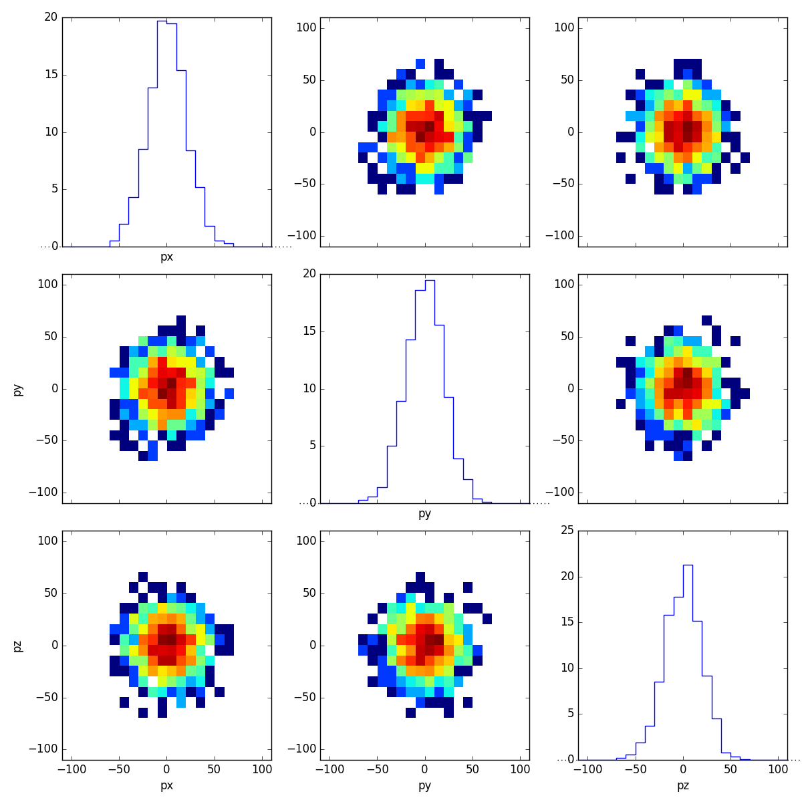
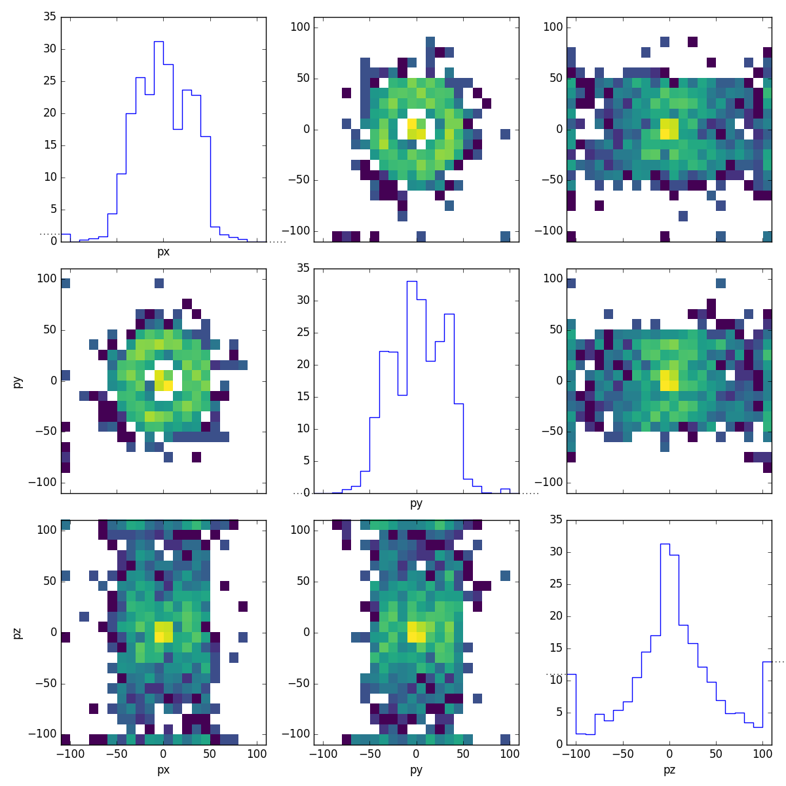
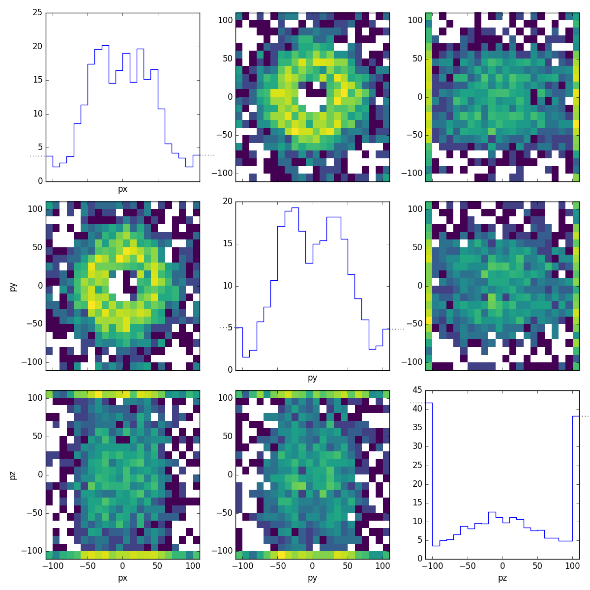

.. _example05:

========================================================
Example 05 -- Advanced data loading with pandas and ROOT
========================================================

Aims
====

*   Use pandas :class:`DataFrame` to fill a :class:`.Binning`
*   Use uproot to load ROOT files and fill them into a :class:`.Binning`

Instructions
============

Pandas is an open source, BSD-licensed library providing high-performance,
easy-to-use data structures and data analysis tools for the Python programming
language:

https://pandas.pydata.org/

It provides a :class:`DataFrame` class, which is a useful tool to organise
structured data::

    from six import print_
    from remu import binning
    import numpy as np
    import pandas as pd
    pd.set_option('display.max_rows', 10)

    px = np.random.randn(1000)*20
    py = np.random.randn(1000)*20
    pz = np.random.randn(1000)*20
    df = pd.DataFrame({'px': px, 'py': py, 'pz': pz})
    print_(df)

.. include:: df.txt
    :literal:

ReMU supports :class:`DataFrame` objects as inputs for all
:meth:`fill <.Binning.fill>` methods::

    with open("muon-binning.yml", 'rt') as f:
        muon_binning = binning.yaml.load(f)

    muon_binning.fill(df)
    muon_binning.plot_values("pandas.png", variables=(None,None))

This way, ReMU supports the same input file formats as the pandas library,
e.g. CSV, JSON, HDF5, SQL, etc..
Using the uproot library, pandas can also be used to load ROOT files:

https://github.com/scikit-hep/uproot

The ROOT framework is the de-facto standard for data analysis in high energy
particle physics:

https://root.cern.ch/

Uproot does *not* need the actual ROOT framework to be installed to work. It
can convert a flat ROOT :class:`TTree` directly into a usable pandas
:class:`DataFrame`::

    import uproot

    flat_tree = uproot.open("Zmumu.root")['events']
    print_(flat_tree.keys())

.. include:: flat_keys.txt
    :literal:

::

    df = flat_tree.pandas.df()
    print_(df)

.. include:: flat_df.txt
    :literal:

::

    muon_binning.reset()
    muon_binning.fill(df, rename={'px1': 'px', 'py1': 'py', 'pz1': 'pz'})
    muon_binning.plot_values("flat_muons.png", variables=(None,None))

ReMU expects exactly one row per event. If the root file is not flat, but has a
more complicated structure, it must be converted to that structure first. For
example, let us take a look at a file where each event has varying numbers of
reconstructed particles::

    structured_tree = uproot.open("HZZ.root")['events']
    print_(structured_tree.keys())

.. include:: structured_keys.txt
    :literal:

::

    df = structured_tree.pandas.df(flatten=False)
    print_(df)

.. include:: structured_df.txt
    :literal:

This kind of data frame with lists as cell elements can be inconvenient to
handle. Uproot can flatten such a tree, when only variables with a single
value or the same number of values are selected::

    df = structured_tree.pandas.df(['NMuon', 'Muon_Px', 'Muon_Py', 'Muon_Pz'])
    print_(df)

.. include:: flattened_df.txt
    :literal:

This double-index structure is still not suitable as input for ReMU, though. We
can select only the first muon in each event, to get the required "one event
per row" structure::

    df = df.loc[(slice(None),0), :]
    print_(df)

.. include:: sliced_df.txt
    :literal:

::

    muon_binning.reset()
    muon_binning.fill(df, rename={'Muon_Px': 'px', 'Muon_Py': 'py', 'Muon_Pz': 'pz'})
    muon_binning.plot_values("sliced_muons.png", variables=(None,None))

