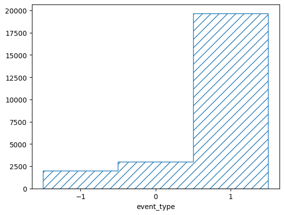
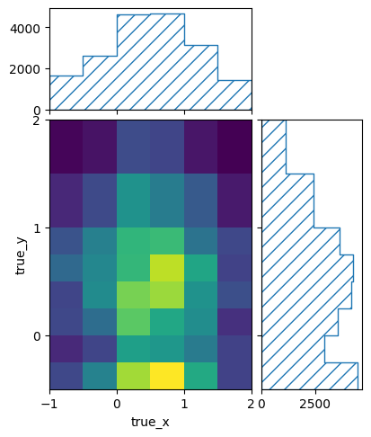
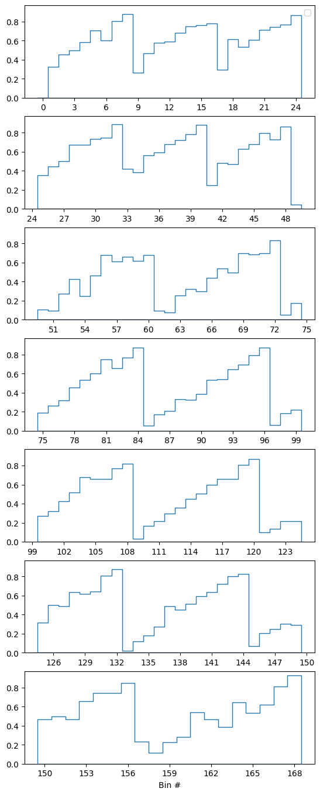
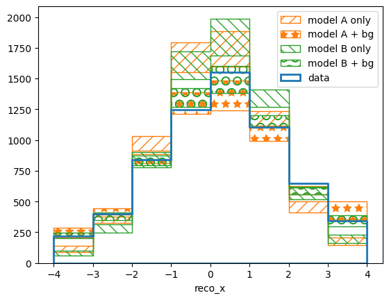
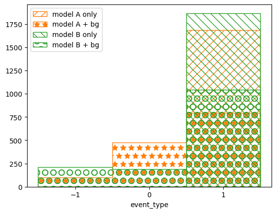

.. _example05:

=========================
Example 05 -- Backgrounds
=========================

Aims
====

*   Understand and deal with background events in measurements

Instructions
============

Real experiments will almost always include some sort of background or noise
events in the recorded data. ReMU is well equipped to deal with those in a
consistent fashion.

Let us first create the noisy data as well as simulations of background and
noise events::

    # Create "real" data
    ../simple_experiment/run_experiment.py 10 real_data.txt --enable-background

    # Create BG simulation
    ../simple_experiment/simulate_experiment.py 100 background nominal_bg_data.txt bg_truth.txt

    # Create Noise simulation
    ../simple_experiment/simulate_experiment.py 100 noise noise_data.txt noise_truth.txt

    # Create Variations
    ../simple_experiment/vary_detector.py nominal_bg_data.txt bg_data.txt

In this context, we call "noise" events that are recorded, but that do not have
a meaningful true information associated with them. "Background" on the other
hand can be understood as regular events in the detector, but which we are not
interested in (e.g. because they are created by a different process than our
main subject of study).

Background events can behave differently than signal events, but because they
also have a defined true information, we can treat them just like signal. The
only difference is that they will occupy different truth bins than the signal
events.

Noise events on the other hand do not have meaningful true properties, so we
will just assign them all to a single truth bin. The content of that single bin
will then determine the number of expected noise events in the reconstructed
binnings.

Starting from the truth binning we created for the signal models in a previous
example, let us create a binning for the background events::

    import numpy as np
    from remu import binning
    from remu import migration
    from remu import matrix_utils
    from remu import plotting

    builder = migration.ResponseMatrixArrayBuilder(1)

    with open("../01/reco-binning.yml", 'rt') as f:
        reco_binning = binning.yaml.full_load(f)
    with open("../01/optimised-truth-binning.yml", 'rt') as f:
        signal_binning = binning.yaml.full_load(f)

    bg_binning = signal_binning.clone()
    resp = migration.ResponseMatrix(reco_binning, bg_binning)
    i = 0
    resp.fill_from_csv_file("bg_data.txt", weightfield='weight_%i'%(i,),
        rename={'reco_x_%i'%(i,): 'reco_x'}, buffer_csv_files=True)
    resp.fill_up_truth_from_csv_file("bg_truth.txt", buffer_csv_files=True)
    entries = resp.get_truth_entries_as_ndarray()
    while np.min(entries) < 10:
        resp = matrix_utils.improve_stats(resp)
        entries = resp.get_truth_entries_as_ndarray()
    bg_binning = resp.truth_binning
    bg_binning.reset()
    reco_binning.reset()

This ``bg_binning`` will now include at least 10 events in each truth bin, when
building the response matrix.

Next we will create a binning that can distinguish between noise, background
and signal events, according to a variable aptly called ``event_type``::

    truth_binning = binning.LinearBinning(
        variable = 'event_type',
        bin_edges = [-1.5, -0.5, 0.5, 1.5],
        subbinnings = {
            1: bg_binning,
            2: signal_binning,
            }
        )

    with open("truth-binning.yml", 'wt') as f:
        binning.yaml.dump(truth_binning, f)

The :class:`.LinearBinning` would have only three bins, but we insert the
previously created background and signal binnings as subbinnings into the
second and third bin respectively. This means that events which would fall into
those bins will get further subdivided by the subbinnings. We thus have a
binning that puts noise events (``event_type == -1``) into a single bin, sorts
background events (``event_type == 0``) according to ``bg_binning``, and sorts
signal events (``event_type == 1``) according to ``signal_binning``.

Now we create a :class:`.ResponseMatrix` with this binning, just like we did in
previous examples::

    resp = migration.ResponseMatrix(reco_binning, truth_binning,
                                    nuisance_indices=[0])

To fill the matrix, we need to tell it which ``event_type`` each event is,
though. This information might already be part of the simulated data, but
in this case we have to add that variable by hand.

For this we can use the ``cut_function`` parameter. A cut function takes the
data (a structured numpy array) as its only argument and returns the data that
should be filled into the binning::

    import numpy.lib.recfunctions as rfn
    def set_signal(data):
        return rfn.append_fields(data, 'event_type', np.full_like(data['true_x'], 1.))
    def set_bg(data):
        return rfn.append_fields(data, 'event_type', np.full_like(data['true_x'], 0.))
    def set_noise(data):
        return rfn.append_fields(data, 'event_type', np.full_like(data['reco_x'], -1.))

    n_toys = 100
    for i in range(n_toys):
        resp.reset()
        resp.fill_from_csv_file(["../03/modelA_data.txt", "../03/modelB_data.txt"],
            weightfield='weight_%i'%(i,), rename={'reco_x_%i'%(i,): 'reco_x'},
            cut_function=set_signal, buffer_csv_files=True)
        resp.fill_up_truth_from_csv_file(
            ["../00/modelA_truth.txt", "../00/modelB_truth.txt"],
            cut_function=set_signal, buffer_csv_files=True)
        resp.fill_from_csv_file("bg_data.txt", weightfield='weight_%i'%(i,),
            rename={'reco_x_%i'%(i,): 'reco_x'}, cut_function=set_bg,
            buffer_csv_files=True)
        resp.fill_up_truth_from_csv_file("bg_truth.txt", cut_function=set_bg,
            buffer_csv_files=True)
        # Calling `fill_up_truth_from_csv` twice only works because
        # the files fill completely different bins
        resp.fill_from_csv_file("noise_data.txt", cut_function=set_noise,
            buffer_csv_files=True)
        builder.add_matrix(resp)

    builder.export("response_matrix.npz")

We can take a look at the truth information that has been filled into the last
of the matrices::

    pltr = plotting.get_plotter(truth_binning)
    pltr.plot_values(density=False)
    pltr.savefig('truth.png')

The base binning is a :class:`.LinearBinning` with only three bins. The
corresponding plotter does not know how to plot the subbinnings, so it just
marginalizes them out. Do plot the content of all truth bins, we can use the
basic :class:`.BinningPlotter`, which simply plots the content of each bin::

    pltr = plotting.BinningPlotter(truth_binning)
    pltr.plot_values(density=False)
    pltr.savefig('all_truth.png')

We can look at the content of the subbinings directly for some nicer plots::

    pltr = plotting.get_plotter(signal_binning)
    pltr.plot_values()
    pltr.savefig('signal_truth.png')

::

    pltr = plotting.get_plotter(bg_binning)
    pltr.plot_values()
    pltr.savefig('bg_truth.png')

And we can take a look at the efficiencies using the corresponding convenience
function::

    matrix_utils.plot_mean_efficiency(resp, "efficiency.png")

Next we can use the response matrix for some hypothesis tests. First we need to
create the :class:`.ResponseMatrixPredictor` and the templates to be used with
the :class:`.TemplatePredictor`::

    from remu import likelihood
    from multiprocess import Pool
    pool = Pool(8)
    likelihood.mapper = pool.map

    with open("../01/reco-binning.yml", 'rt') as f:
        reco_binning = binning.yaml.full_load(f)
    with open("truth-binning.yml", 'rt') as f:
        truth_binning = binning.yaml.full_load(f)

    reco_binning.fill_from_csv_file("real_data.txt")
    data = reco_binning.get_entries_as_ndarray()
    data_model = likelihood.PoissonData(data)

    response_matrix = "response_matrix.npz"
    matrix_predictor = likelihood.ResponseMatrixPredictor(response_matrix)

    calc = likelihood.LikelihoodCalculator(data_model, matrix_predictor)
    maxi = likelihood.BasinHoppingMaximizer()

    import numpy.lib.recfunctions as rfn
    def set_signal(data):
        return rfn.append_fields(data, 'event_type', np.full_like(data['true_x'], 1.))
    def set_bg(data):
        return rfn.append_fields(data, 'event_type', np.full_like(data['true_x'], 0.))

    truth_binning.fill_from_csv_file("../00/modelA_truth.txt",
                                     cut_function=set_signal)
    modelA = truth_binning.get_values_as_ndarray()
    modelA /= np.sum(modelA)

    truth_binning.reset()
    truth_binning.fill_from_csv_file("../00/modelB_truth.txt",
                                     cut_function=set_signal)
    modelB = truth_binning.get_values_as_ndarray()
    modelB /= np.sum(modelB)

    truth_binning.reset()
    truth_binning.fill_from_csv_file("bg_truth.txt", cut_function=set_bg)
    bg = truth_binning.get_values_as_ndarray()
    bg /= np.sum(bg)

    truth_binning.reset()
    noise = truth_binning.get_values_as_ndarray()
    noise[0] = 1.

Since we put all noise events into the first truth bin, the noise template is
just a value of 1 in that bin.

Now we start by trying to fit the model A template without background or noise
events::

    modelA_only = likelihood.TemplatePredictor([modelA])
    calcA_only = calc.compose(modelA_only)

    retA_only = maxi(calcA_only)
    print_(retA_only)

.. include:: modelA_only_fit.txt
    :literal:

To judge how well the result actually fit, we can consult the results p-value::

    testA_only = likelihood.HypothesisTester(calcA_only)
    print_(testA_only.likelihood_p_value(retA_only.x))

.. include:: modelA_only_gof.txt
    :literal:

It clearly is a very bad fit, which is reflected in the maximum likelihood
p-value as well::

    print_(testA_only.max_likelihood_p_value())

.. include:: modelA_only_p_value.txt
    :literal:

So the signal-only model A hypothesis can be excluded. Now let us try again
with background and noise templates added in::

    modelA_bg = likelihood.TemplatePredictor([noise, bg, modelA])
    calcA_bg = calc.compose(modelA_bg)

    retA_bg = maxi(calcA_bg)
    print_(retA_bg)

.. include:: modelA_bg_fit.txt
    :literal:

::

    testA_bg = likelihood.HypothesisTester(calcA_bg)
    print_(testA_bg.likelihood_p_value(retA_bg.x))

.. include:: modelA_bg_gof.txt
    :literal:

::

    print_(testA_bg.max_likelihood_p_value(), file=f)

.. include:: modelA_bg_p_value.txt
    :literal:

This fit is clearly much better. We can repeat the same with model B::

    modelB_only = likelihood.TemplatePredictor([modelB])
    calcB_only = calc.compose(modelB_only)

    retB_only = maxi(calcB_only)
    print_(retB_only)

.. include:: modelB_only_fit.txt
    :literal:

::

    testB_only = likelihood.HypothesisTester(calcB_only)
    print_(testB_only.likelihood_p_value(retB_only.x))

.. include:: modelB_only_gof.txt
    :literal:

::

    print_(testB_only.max_likelihood_p_value())

.. include:: modelB_only_p_value.txt
    :literal:

::

    modelB_bg = likelihood.TemplatePredictor([noise, bg, modelB])
    calcB_bg = calc.compose(modelB_bg)

    retB_bg = maxi(calcB_bg)
    print_(retB_bg)

.. include:: modelB_bg_fit.txt
    :literal:

::

    testB_bg = likelihood.HypothesisTester(calcB_bg)
    print_(testB_bg.likelihood_p_value(retB_bg.x))

.. include:: modelB_bg_gof.txt
    :literal:

::

    print_(testB_bg.max_likelihood_p_value())

.. include:: modelB_bg_p_value.txt
    :literal:

We can also take a qualitative look at the results by plotting the maximum
likelihood predictions in reco and truth space::

    pltr = plotting.get_plotter(reco_binning)
    modelA_reco, modelA_weights = calcA_only.predictor(retA_only.x)
    modelB_reco, modelB_weights = calcB_only.predictor(retB_only.x)
    modelA_bg_reco, modelA_bg_weights = calcA_bg.predictor(retA_bg.x)
    modelB_bg_reco, modelB_bg_weights = calcB_bg.predictor(retB_bg.x)
    pltr.plot_array(modelA_reco, label='model A only', stack_function=0.68,
                    hatch=r'//', edgecolor='C1')
    pltr.plot_array(modelA_bg_reco, label='model A + bg', stack_function=0.68,
                    hatch=r'*', edgecolor='C1')
    pltr.plot_array(modelB_reco, label='model B only', stack_function=0.68,
                    hatch=r'\\', edgecolor='C2')
    pltr.plot_array(modelB_bg_reco, label='model B + bg', stack_function=0.68,
                    hatch=r'O', edgecolor='C2')
    pltr.plot_entries(edgecolor='C0', label='data', hatch=None, linewidth=2.)
    pltr.legend()
    pltr.savefig('reco-comparison.png')

::

    pltr = plotting.get_plotter(truth_binning)
    pltr.plot_array(modelA_only(retA_only.x)[0], label='model A only',
                    hatch=r'//', edgecolor='C1', density=False)
    pltr.plot_array(modelA_bg(retA_bg.x)[0], label='model A + bg',
                    hatch=r'*', edgecolor='C1', density=False)
    pltr.plot_array(modelB_only(retB_only.x)[0], label='model B only',
                    hatch=r'\\', edgecolor='C2', density=False)
    pltr.plot_array(modelB_bg(retB_bg.x)[0], label='model B + bg',
                    hatch=r'O', edgecolor='C2', density=False)
    pltr.legend(loc='upper left')
    pltr.savefig('truth-comparison.png')

