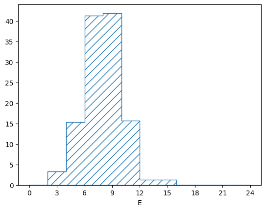
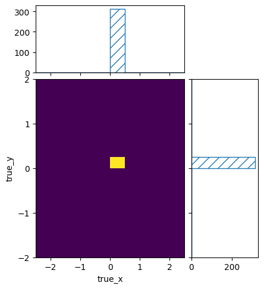
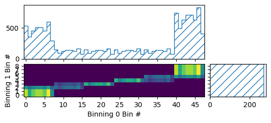
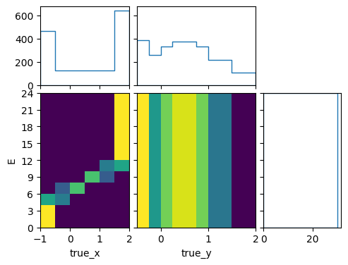
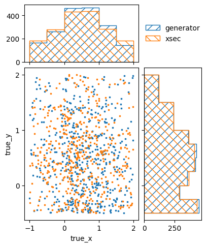
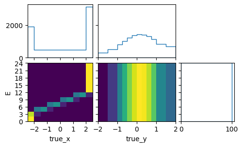
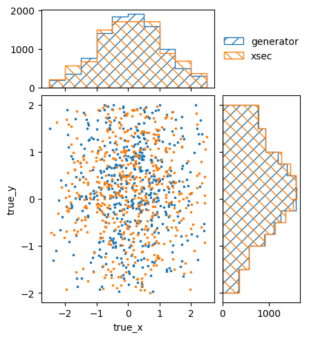
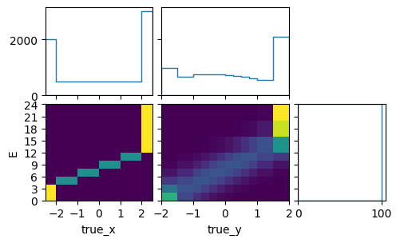
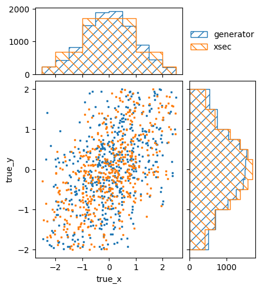
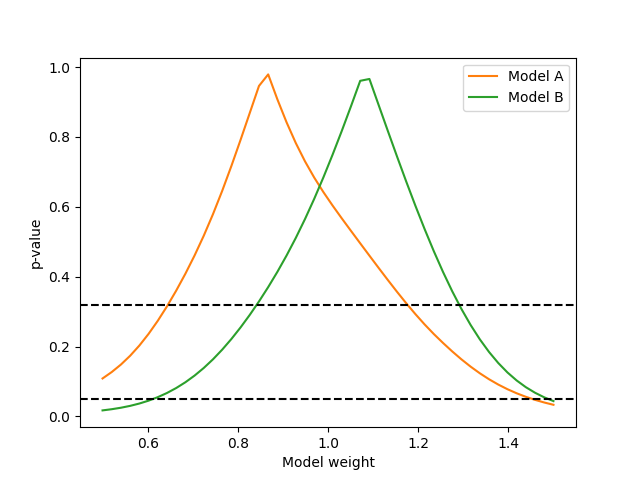

.. _example06:

=================================================
Example 06 -- Cross sections & flux uncertainties
=================================================

Aims
====

*   Turn cross sections as input parameters into event numbers using fluxes
*   Implement flux uncertainties

Instructions
============

So far we have concentrated on raw event numbers or simple template scaling
parameters to parameterize the number of events we expect to see in our
detector. But these raw numbers or templates themselves depend on other more
fundamental parameters.

E.g, if you are recording products of a radioactive decay, they will depend on
the number of radioactive nuclei inside the detector, the decay rates into the
different states you are distinguishing, and the total amount of time the
experiment was collecting data::

    n_true_events_in_state_j = N_nuclei * time * decay_rate_to_state_j

Of these three parameters, the decay rate is usually the truly interesting one.
It is the physics one wants to examine with the experimental setup. The number
of nuclei and the time that the experiment ran on the other hand are just
properties of the experimental setup and the data that was recorded. So just
like the detector response, it would be good if we could absorb them into a
:class:`.Predictor`, so that we can do statistical tests with the interesting
physics parameters directly.

A slightly more complicated example is the measurement of interactions of a
particle beam with a target material, e.g. a neutrino beam with a water target.
Here the number of true events depends and the neutrino flux as a function of
the neutrino energy, the number of target molecules in the detector, and the
neutrino interaction cross sections for the different final states
distinguished by the detector::

    n_true_events_j = T * sum_k(sigma_jk * F_k)

Here `T` is the number of targets, `F_k` is the integrated recorded neutrino
flux in neutrino energy bin `k` (unit: neutrinos/m^2), and `sigma_jk` is the
cross section for neutrinos in energy bin `k` to cause a reaction to the final
state `j` that can be recorded by the detector.

In general, a lot of experimental setups can be described with a matrix
multiplication in the form::

    n_true_events_j = sum_k(physics_parameter_matrix_jk * exposure_k)

Depending on the details of the experiment, the parameter matrix and exposure
vector have slightly different meanings. In the case of the radioactive decay
measurement, the physics parameters would be the decay rates, and the exposure
would be the product of number of nuclei and the recording time. In the
neutrino case the parameters would be the cross sections, and the exposure
would be the product of integrated neutrino fluxes and target mass. In the
context of a collider experiment, the exposure would probably be called an
integrated luminosity.

We will extend the previous example and treat it like a neutrino beam experiment.
First we will need to get the binning in the true event properties::

    import numpy as np
    import pandas as pd

    from remu import binning

    with open("../05/truth-binning.yml") as f:
        truth_binning = binning.yaml.full_load(f)

    # Get truth binnings for BG and signal
    bg_truth_binning = truth_binning.subbinnings[1].clone()
    signal_truth_binning = truth_binning.subbinnings[2].clone()

As a binning for the flux, we will use a simple linear binning in the neutrino
energy:

.. include:: flux-binning.yml
    :literal:

::

    # Define flux binning
    with open("flux-binning.yml") as f:
        flux_binning = binning.yaml.full_load(f)

The binning of the cross section is done as a :class:`.CartesianProductBinning`.
Every possible combination of true kinematic bin and true neutrino energy bin
gets its own cross-section values::

    # Create cross-section binnings
    bg_flux_binning = flux_binning.clone()
    bg_xsec_binning = binning.CartesianProductBinning((bg_truth_binning, bg_flux_binning))
    signal_flux_binning = flux_binning.clone()
    signal_xsec_binning = binning.CartesianProductBinning(
        (signal_truth_binning, signal_flux_binning)
    )

We can have a look at the structure of the resulting binning::

    # Check binning structure
    n_bg_truth = bg_truth_binning.data_size
    n_signal_truth = signal_truth_binning.data_size
    n_flux = flux_binning.data_size
    n_bg_xsec = bg_xsec_binning.data_size
    n_signal_xsec = signal_xsec_binning.data_size
    print(n_bg_truth, n_signal_truth, n_flux)
    print(n_bg_xsec, n_signal_xsec)
    print(signal_xsec_binning.bins[0].data_indices)
    print(signal_xsec_binning.bins[1].data_indices)
    print(signal_xsec_binning.bins[n_flux].data_indices)

.. include:: check_binning.txt
    :literal:

An increase of the bin index by one means that we increase the corresponding
data index in the flux binning by one. Once every flux bin has been stepped
through, the data index in the truth binning increases by one.

To create a :class:`.Predictor` that can turn cross sections into event
numbers, we need an actual neutrino flux. We can easily create one by filling
the flux binning::

    # Fill flux with exposure units (proportional to neutrinos per m^2)
    from remu import plotting
    from numpy.random import default_rng

    rng = default_rng()
    E = rng.normal(loc=8.0, scale=2.0, size=1000)
    df = pd.DataFrame({"E": E})
    flux_binning.fill(df, weight=0.01)

We fill the binning with a weight of 0.01 so that the total amount of exposure
in the binning is 10, corresponding with the assumed 10 years of data taking
used for the event generation in the previous examples. So one "unit" of
exposure corresponds to one year of data taking.

The "simulated" flux looks like this::

    pltr = plotting.get_plotter(flux_binning)
    pltr.plot_values()
    pltr.savefig("flux.png")

Of course the exact flux is never known (especially with neutrino experiments).
To simulate a flux uncertainty, we can just create lots of throws::

    # Create fluctuated flux predictions
    E_throws = rng.normal(loc=8.0, scale=2.0, size=(100,1000))
    flux = []
    for E in E_throws:
        df = pd.DataFrame({"E": E})
        flux_binning.reset()
        flux_binning.fill(df, weight=0.01)
        flux.append(flux_binning.get_values_as_ndarray())

    flux = np.asfarray(flux)
    print(flux.shape)

.. include:: flux_shape.txt
    :literal:

Now we can use those flux predictions to create a
:class:`.LinearEinsumPredictor` that will do the correct matrix multiplication
to combine the cross sections and the flux into event numbers::

    # Create event number predictors
    from multiprocess import Pool
    from remu import likelihood
    pool = Pool(8)
    likelihood.mapper = pool.map

    bg_predictor = likelihood.LinearEinsumPredictor(
        "ij,...kj->...ik",
        flux,
        reshape_parameters=(n_bg_truth, n_flux),
        bounds=[(0.0, np.inf)] * bg_xsec_binning.data_size,
    )
    signal_predictor = likelihood.LinearEinsumPredictor(
        "ij,...kj->...ik",
        flux,
        reshape_parameters=(n_signal_truth, n_flux),
        bounds=[(0.0, np.inf)] * signal_xsec_binning.data_size,
    )

Let us do a quick test of the predictions::

    # Test cross-section predictions
    signal_xsec_binning.reset()
    signal_xsec_binning.fill({"E": 8.0, "true_x": 0.0, "true_y": 0.0}, 100.0)
    signal_xsec = signal_xsec_binning.get_values_as_ndarray()

    signal_events, weights = signal_predictor(signal_xsec)
    signal_truth_binning.set_values_from_ndarray(signal_events)
    pltr = plotting.get_plotter(signal_truth_binning)
    pltr.plot_values(density=False)
    pltr.savefig("many_events.png")

::

    signal_xsec_binning.reset()
    signal_xsec_binning.fill({"E": 3.0, "true_x": 0.0, "true_y": 0.0}, 100.0)
    signal_xsec = signal_xsec_binning.get_values_as_ndarray()

    signal_events, weights = signal_predictor(signal_xsec)
    signal_truth_binning.set_values_from_ndarray(signal_events)
    pltr = plotting.get_plotter(signal_truth_binning)
    pltr.plot_values(density=False)
    pltr.savefig("few_events.png")

Despite filling the same cross section to the same true kinematics int the two
cases, the resulting number of events was different. This is of course because
the flux at 3 is smaller than the flux at 8. So even if the cross sections at 3
and 8 are the same, the different flux will lead to a different number of
predicted events.

Finally we need a predictor for the noise events. These are events that do not
correspond to any interesting physics and are just weighted up or down with a
single parameter as input to the response matrix, so we will just pass through
that single parameter. We will use the :class:`.TemplatePredictor` for this,
since it set the parameter limits to ``(0, np.inf)`` by default, which is
convenient here. In order or the systematics to line up, we will have to create
100 identical "variations"::

    # Create noise predictor
    noise_predictor = likelihood.TemplatePredictor([[[1.0]]] * 100)

Now that we have the three separate predictors for the noise, background, and
signal events, we need to combine them into a single
:class:`.ConcatenatedPredictor`::

    # Combine into single predictor
    event_predictor = likelihood.ConcatenatedPredictor(
        [noise_predictor, bg_predictor, signal_predictor],
        combine_systematics="same"
    )

The input of the combined predictor will be a concatenation of the separate
inputs. I.e. first the single noise scaling parameter, then the background
cross-section parameters, and finally the signal cross-section parameters. The
output likewise will be a concatenation of the single output: first the
unmodified noise scaling parameter, then the background events numbers, and
finally the signal event numbers. If we have done everything right, this
corresponds exactly to the meaning of the data of the original `truth_binning`,
so it can be used as input for the response matrix.

At this point we could combine the event predictor with a response matrix and
likelihood calculator to do statistical tests with the cross-section
parameters. With hundreds or thousands of parameters, this is a computationally
intensive task though. So for this tutorial we will again define some models as
templates and investigate them by varying their weights.

In order to to simplify that task, we will first create a binning that
encapsulates all input parameters for the `event_predictor`::

    parameter_binning = truth_binning.marginalize_subbinnings()
    parameter_binning = parameter_binning.insert_subbinning(1, bg_xsec_binning)
    parameter_binning = parameter_binning.insert_subbinning(2, signal_xsec_binning)

We started by marginalizing out all subbinnings in the original
`truth_binning`, which yield a binning that only distinguishes the three event
types in order: noise, background, signal. Then we inserted the cross-section
binnings as subbinnings into their respective top level bins. This leaves us
with a binning where the desired data structure: first a single bin for the
noise, then the background cross-section bins as defined by the
`bg_xsec_binning`, and finally the signal cross-section bins as defined by
`signal_xsec_binning`.

The template for the noise events is simple. Again, we just want to scale the
noise parameter directly::

    noise_template = np.zeros(parameter_binning.data_size)
    noise_template[0] = 1.0

For the cross-section templates, we need to take a look at the cross-section
bins, so we can understand what values to put in them::

    for i, b in enumerate(bg_xsec_binning.bins):
        # Get truth and flux bin from Cartesian Product
        truth_bin, flux_bin = b.get_marginal_bins()

        print(i)
        print(truth_bin)
        print(flux_bin)

        break

.. include:: marginal_bins.txt
    :literal:

The method :meth:`.CartesianProductBin.get_marginal_bins` returns the bins of
the original binnings, that correspond to the given bin of the
:class:`.CartesianProductBinning`. In this case, these are the bin of the true
kinematics, and the bin of the neutrino Energy. For each we have the `edges` of
the bin, so we can use those to calculate the correct cross section: The number
of true events expected in the given truth bin, for each unit of exposure in
the given flux bin::

    from scipy.stats import expon, norm, uniform

    def calculate_bg_xsec(E_min, E_max, x_min, x_max, y_min, y_max):
        """Calculate the cross section for the BG process."""

        # We need to make an assumption about the E dsitribution within the E bin
        # Bin edges can be +/- np.inf
        if np.isfinite(E_min) and np.isfinite(E_max):
            # Uniform in given bounds
            E_dist = uniform(loc=E_min, scale=E_max - E_min)
        elif np.isfinite(E_min):
            # Exponential from E_min to inf
            E_dist = expon(loc=E_min)
        else:
            # Exponential from -inf to E_max
            E_dist = expon(loc=E_max, scale=-1)

        # Simple overall cross section: One unit of exposure yields 30 true events
        xsec = 30.0

        # True x is True E with a shift and scale
        # Average XSEC in bin is proportional to overlap
        E_0 = (x_min - 0.5) * 2 / np.sqrt(0.5) + 8
        E_1 = (x_max - 0.5) * 2 / np.sqrt(0.5) + 8
        lower = max(E_min, E_0)
        upper = min(E_max, E_1)
        if upper >= lower:
            xsec *= E_dist.cdf(upper) - E_dist.cdf(lower)
        else:
            xsec = 0.0

        # Differential XSEC in y is Gaussian
        # Independent of x
        y_dist = norm(loc=0.5, scale=np.sqrt(0.5))
        xsec *= y_dist.cdf(y_max) - y_dist.cdf(y_min)

        return xsec

    bg_template = np.zeros(parameter_binning.data_size)
    bg_xsec = np.zeros(bg_xsec_binning.data_size)
    bg_offset = parameter_binning.get_bin_data_index(1)
    for i, b in enumerate(bg_xsec_binning.bins):
        # Get truth and flux bin from Cartesian Product
        truth_bin, flux_bin = b.get_marginal_bins()

        E_min, E_max = flux_bin.edges[0]
        x_min, x_max = truth_bin.edges[0]
        y_min, y_max = truth_bin.edges[1]

        bg_xsec[i] = calculate_bg_xsec(E_min, E_max, x_min, x_max, y_min, y_max)
        bg_template[i + bg_offset] = bg_xsec[i]

    pltr = plotting.get_plotter(bg_xsec_binning)
    pltr.plot_array(bg_xsec)
    pltr.savefig("bg_xsec.png")

This plot of the template is not very intuitive, since the plotter of a general
:class:`.CartesianProductBinning` does not know the meaning of the single bins
in the constituent binnings. So it can only plot bin numbers vs one another. A
:class:`.CatesianProductBinning` consisting of only
:class:`.RectilinearBinning`, and :class:`.LinearBinning` without any
subbinnings has the same data structure as a :class:`.RectilinearBinning`
though, so we can use that plotter to get a slightly more readable plot::

    bg_xsec_plot_binning = binning.RectilinearBinning(
        bg_truth_binning.variables + (flux_binning.variable,),
        bg_truth_binning.bin_edges + (flux_binning.bin_edges,),
    )
    pltr = plotting.get_plotter(bg_xsec_plot_binning)
    pltr.plot_array(bg_xsec, density=[0, 1], hatch=None)
    pltr.savefig("bg_xsec_pretty.png")

Here we told the plotter to only plot densities with relation to variables 0
and 1, i.e. `true_x` and `true_y`. This means the plots are "differential" in
`true_X` and `true_y` but not in E. The marginal plot of the E "distribution"
shows the total cross section of each bin, and not a density. The marginal
plots of `true_x` and `true_y` are technically differential cross sections, but
in this particular case they are flux integrated over a flux with one unit of
exposure in each energy bin. In order to see the flux integrated cross sections
in the actual flux, we need to use the predictors to actually predict the
number of events::

    bg_truth_binning.reset()
    bg_truth_binning.fill_from_csv_file("../05/bg_truth.txt", weight=0.1)
    pltr = plotting.get_plotter(bg_truth_binning)
    pltr.plot_values(scatter=500, label="generator")

    bg_pred, w = bg_predictor(bg_xsec)
    pltr.plot_array(bg_pred, scatter=500, label="xsec")

    pltr.legend()
    pltr.savefig("bg_prediction.png")

Here we also plotted the previously generated number of events for comparison.
The prediction from the cross-section model is not a perfect match, but it is
very close.

Now that we have a cross section for the background process, we need to repeat
this process for the two signal processes::

    def calculate_model_A_xsec(E_min, E_max, x_min, x_max, y_min, y_max):
        """Calculate the cross section for the model A process."""

        # We need to make an assumption about the E dsitribution within the E bin
        # Bin edges can be +/- np.inf
        if np.isfinite(E_min) and np.isfinite(E_max):
            # Uniform in given bounds
            E_dist = uniform(loc=E_min, scale=E_max - E_min)
        elif np.isfinite(E_min):
            # Exponential from E_min to inf
            E_dist = expon(loc=E_min)
        else:
            # Exponential from -inf to E_max
            E_dist = expon(loc=E_max, scale=-1)

        # Simple overall cross section: One unit of exposure yields 100 true events
        xsec = 100.0

        # True x is True E with a shift and scale
        # Average XSEC in bin is proportional to overlap
        E_0 = (x_min - 0.1) * 2.0 + 8
        E_1 = (x_max - 0.1) * 2.0 + 8
        lower = max(E_min, E_0)
        upper = min(E_max, E_1)
        if upper >= lower:
            xsec *= E_dist.cdf(upper) - E_dist.cdf(lower)
        else:
            xsec = 0.0

        # Differential XSEC in y is Gaussian
        # Independent of x
        y_dist = norm(loc=0.2, scale=1.0)
        xsec *= y_dist.cdf(y_max) - y_dist.cdf(y_min)

        return xsec

    model_A_xsec = np.zeros(signal_xsec_binning.data_size)
    model_A_template = np.zeros(parameter_binning.data_size)
    signal_offset = parameter_binning.get_bin_data_index(2)
    for i, b in enumerate(signal_xsec_binning.bins):
        # Get truth and flux bin from Cartesian Product
        truth_bin, flux_bin = b.get_marginal_bins()

        E_min, E_max = flux_bin.edges[0]
        x_min, x_max = truth_bin.edges[0]
        y_min, y_max = truth_bin.edges[1]

        model_A_xsec[i] = calculate_model_A_xsec(E_min, E_max, x_min, x_max, y_min, y_max)
        model_A_template[i + signal_offset] = model_A_xsec[i]

    signal_xsec_plot_binning = binning.RectilinearBinning(
        signal_truth_binning.variables + (flux_binning.variable,),
        signal_truth_binning.bin_edges + (flux_binning.bin_edges,),
    )
    pltr = plotting.get_plotter(signal_xsec_plot_binning)
    pltr.plot_array(model_A_xsec, density=[0, 1], hatch=None)
    pltr.savefig("model_A_xsec.png")

::

    signal_truth_binning.reset()
    signal_truth_binning.fill_from_csv_file("../00/modelA_truth.txt", weight=0.1)
    pltr = plotting.get_plotter(signal_truth_binning)
    pltr.plot_values(scatter=500, label="generator")

    model_A_pred, w = signal_predictor(model_A_xsec)
    pltr.plot_array(model_A_pred, scatter=500, label="xsec")

    pltr.legend()
    pltr.savefig("model_A_prediction.png")

::

    model_B_xsec = np.zeros(signal_xsec_binning.data_size)
    model_B_template = np.zeros(parameter_binning.data_size)
    signal_offset = 1 + bg_xsec_binning.data_size

    def calculate_model_B_xsec(E_min, E_max, x_min, x_max, y_min, y_max):
        """Calculate the cross section for the model A process."""

        # We need to make an assumption about the E dsitribution within the E bin
        # Bin edges can be +/- np.inf
        if np.isfinite(E_min) and np.isfinite(E_max):
            # Uniform in given bounds
            E_dist = uniform(loc=E_min, scale=E_max - E_min)
        elif np.isfinite(E_min):
            # Exponential from E_min to inf
            E_dist = expon(loc=E_min)
        else:
            # Exponential from -inf to E_max
            E_dist = expon(loc=E_max, scale=-1)

        # Simple overall cross section: One unit of exposure yields 100 true events
        xsec = 100.0

        # True x is True E with a shift and scale
        # Average XSEC in bin is proportional to overlap
        E_0 = (x_min - 0.0) * 2.0 + 8
        E_1 = (x_max - 0.0) * 2.0 + 8
        lower = max(E_min, E_0)
        upper = min(E_max, E_1)
        if upper >= lower:
            xsec *= E_dist.cdf(upper) - E_dist.cdf(lower)
        else:
            xsec = 0.0

        # Differential XSEC in y is Gaussian
        # Correalted with x
        # Should integrate 2D distribution of x/E and y
        # Instead, cheat and assume median E value
        if np.isfinite(lower) and np.isfinite(upper):
            E_m = (upper + lower) / 2
        elif np.isfinite(lower):
            E_m = lower + 1
        elif np.isfinite(upper):
            E_m = upper - 1
        else:
            E_m = 0.0
        x_m = (E_m - 8.0) / 2

        y_dist = norm(loc=0.5 * x_m, scale=1.0 - 0.5**2)
        xsec *= y_dist.cdf(y_max) - y_dist.cdf(y_min)

        return xsec

    for i, b in enumerate(signal_xsec_binning.bins):
        # Get truth and flux bin from Cartesian Product
        truth_bin, flux_bin = b.get_marginal_bins()

        E_min, E_max = flux_bin.edges[0]
        x_min, x_max = truth_bin.edges[0]
        y_min, y_max = truth_bin.edges[1]

        model_B_xsec[i] = calculate_model_B_xsec(E_min, E_max, x_min, x_max, y_min, y_max)
        model_B_template[i + signal_offset] = model_B_xsec[i]

    pltr = plotting.get_plotter(signal_xsec_plot_binning)
    pltr.plot_array(model_B_xsec, density=[0, 1], hatch=None)
    pltr.savefig("model_B_xsec.png")

::

    signal_truth_binning.reset()
    signal_truth_binning.fill_from_csv_file("../00/modelB_truth.txt", weight=0.1)
    pltr = plotting.get_plotter(signal_truth_binning)
    pltr.plot_values(scatter=500, label="generator")

    model_B_pred, w = signal_predictor(model_B_xsec)
    pltr.plot_array(model_B_pred, scatter=500, label="xsec")

    pltr.legend()
    pltr.savefig("model_B_prediction.png")

Now that we have the templates, we can combine them into a
:class:`.TemplatePredictor`::

    # Template predictor for noise, bg, model A, model B
    xsec_template_predictor = likelihood.TemplatePredictor(
        [noise_template, bg_template, model_A_template, model_B_template]
    )

This can then be combined with the detector response and event predictor to get
the full chain to the reconstructed level::

    # Load data and response matrix

    with open("../01/reco-binning.yml") as f:
        reco_binning = binning.yaml.full_load(f)

    reco_binning.fill_from_csv_file("../05/real_data.txt")
    data = reco_binning.get_entries_as_ndarray()
    data_model = likelihood.PoissonData(data)

    response_matrix = "../05/response_matrix.npz"
    matrix_predictor = likelihood.ResponseMatrixPredictor(response_matrix)

    # Combine into linear predictor
    data_predictor = likelihood.ComposedPredictor(
        [matrix_predictor, event_predictor],
        combine_systematics="same",
    )
    template_predictor = likelihood.ComposedMatrixPredictor(
        [data_predictor, xsec_template_predictor], combine_systematics="cartesian"
    )

We composed the `matrix_predictor` and `event_predictor` with the ``same``
strategy for combining systematics. This means that the 100 flux variations are
matched one-to-one to the 100 detector response variations, for a total of 100
systematic variations. The default ``cartesian`` strategy would man that each
of the 100 detector variations is combined with all of the 100 flux variations,
for a total of 10,000 systematic variations.

For the final `template_predictor` we compose the `data_predictor` and
`xsec_template_predictor` using a :class:`.ComposedMatrixPredictor`. This is a
special kind of :class:`.ComposedPredictor`, which pre-computes a linear
approximation of the composed predictors in the form of a matrix
multiplication. So for a prediction, it does _not_ need to call the original
predictors in order, but only needs to do a simple matrix multiplication, where
the matrix is the size of the number of output parameters times the number of
input parameters. This speeds things up considerably, since we effectively
circumvent the hundreds of cross-section parameters that would otherwise need
to be calculate each time the predictor is called. And since all predictors
that go into this final predictor are actually linear, the linear
"approximation" is actually exact (modulo numerical variations).

Now that we have a performant predictor of the reconstructed data, we can run
statistical analyses with it, like a simple maximum likelihood fit::

    # Likelihood caclulator and hypothesis tester
    calc = likelihood.LikelihoodCalculator(data_model, template_predictor)
    maxi = likelihood.BasinHoppingMaximizer()

    # Fit everything
    ret = maxi.maximize_log_likelihood(calc)
    print(ret)

.. include:: fit.txt
    :literal:

We can calculate the overall p-values for the two hypotheses::

    # Calculate p-values for hypotheses overall
    calc_A = calc.fix_parameters([None, None, None, 0.0])
    calc_B = calc.fix_parameters([None, None, 0.0, None])
    test_A = likelihood.HypothesisTester(calc_A)
    test_B = likelihood.HypothesisTester(calc_B)
    print(test_A.max_likelihood_p_value())
    print(test_B.max_likelihood_p_value())

.. include:: p-values.txt
    :literal:

Or we can do a scan of the Wilks p-value for the model template weights::

    # Get Wilks' p-values for models
    norms = np.linspace(0.5, 1.5, 50)
    p_values_A = []
    p_values_B = []
    for n in norms:
        p_values_A.append(test_A.wilks_max_likelihood_ratio_p_value([None, None, n]))
        p_values_B.append(test_B.wilks_max_likelihood_ratio_p_value([None, None, n]))

    from matplotlib import pyplot as plt

    fig, ax = plt.subplots()
    ax.set_xlabel("Model weight")
    ax.set_ylabel("p-value")
    ax.plot(norms, p_values_A, label="Model A", color="C1")
    ax.plot(norms, p_values_B, label="Model B", color="C2")
    ax.axhline(0.32, color="k", linestyle="dashed")
    ax.axhline(0.05, color="k", linestyle="dashed")
    ax.legend(loc="best")
    fig.savefig("wilks-p-values.png")

Since the flux integrations and uncertainty is now handled by the predictors,
the cross-section parameters (or templates of cross-section parameters) can be
used just like described in the previous examples.
