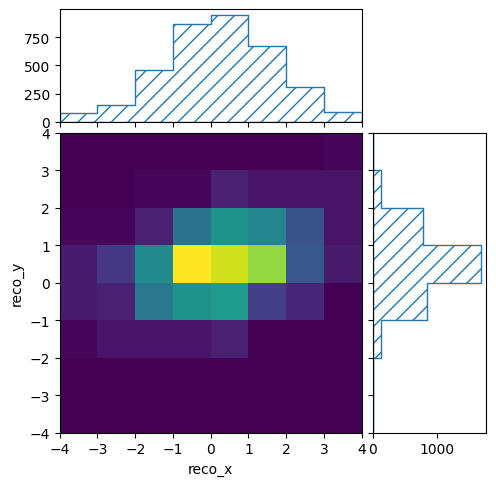
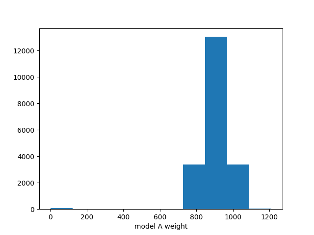
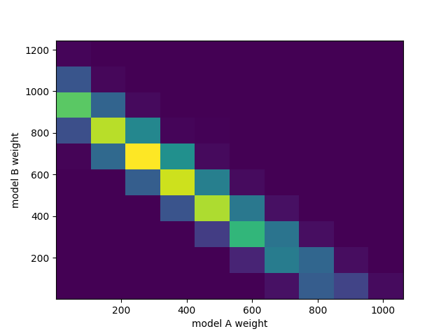

============
Introduction
============

Forward folding
===============

ReMU is a framework for statistical analyses of binned counting experiments. It
follows a "forward-folding" approach to interpreting the data. To understand
the principle of forward folding we must first understand how we interpret the
process of measuring something:

.. image:: real.svg

Nature provides certain expectation values for how many events with different
properties will happen in the detector. These expectation values do not have to
be integers, as they only describe the average number of events that would
occur in each bin if you repeat the experiment many times. In the actual
experiment, we only get a sample from these expectation values. Since these are
actually occurring events, their numbers must be integers. They are randomly
distributed around the expectation values.

We cannot directly observe these events though. Depending on the properties of
the events and the detector that is recording them, some events are missed
(detection efficiency) and the reconstructed properties are not exactly the
true properties of the events (smearing). The only information that is
available to us is the reconstructed sample of events.

In general, we are interested in the expectation values in the true properties
space of the event (truth space), as the reconstructed properties depend on the
specific experiment (reco space). The best way of checking whether a certain
model prediction is compatible with the measured data, is to do a full detector
simulation:

.. image:: fullsim.svg

By simulating a large number of events it is possible to calculate the
expectation value in the reconstructed space. This can then be compared to the
recorded data using Poissonian statistics.

This is a very involved process that requires a lot of computing power and
expert knowledge of the detector. It is usually only done within the
experiments' collaborations and only for a few select models. This process can
be sped up though, if one can find a universal linear relation between the
expectation values in truth :math:`(\mu_j)` and in reco space :math:`(\nu_i)`:

.. math::
    \nu_i = \sum_j P(\text{reco bin} = i \,|\, \text{truth bin} = j) \cdot \mu_j

That relation is the detector response matrix :math:`R_{ij} = P(\text{reco bin}
= i \,|\, \text{truth bin} = j)`:

.. image:: fold.svg

Multiplying a vector of truth expectation values with a matrix is a
computationally simple task. And with the right tools it should be very easily
done also by non-experts (of the detector). ReMU aims to be such a tool.
With the tools, the detector response matrix, and the actual data, it should
be possible to test many different models on short time scales:

.. image:: fasttest.svg

This multiplication of the model predictions with the response matrix is often
called "forward folding". It translates universal model predictions in truth
space to experiment-specific model predictions in reco space. It can be seen
as alternative (or complementary) approach to "unfolding", where the measured
experiment-specific data in reco space is translated to an unfolded universal
spectrum in truth space.

Building the response matrix
============================

Using a response matrix does not require expert knowledge of the detector it
models. Creating the response matrix and making sure it has the desired
properties does.

The most important property of a "correct" response matrix is its
model-independence. No matter what physics model you use to generate the
truth-space expectation values :math:`\mu_j`, the linear coefficients
:math:`R_{ij}` must stay unchanged (within their uncertainties, see below).
Only then can you use the same matrix to test the many different models
that you are interested in.

In practice this usually means that the binning in truth space must be quite
fine, and in more variables than one is interested in for the measurement. For
example, if in a particle physics experiment one is interested in the momentum
of a particle, but the detection efficiency depends on the particle's
direction, it is necessary to also distinguish events by (i.e. "to bin in") the
true direction of the particle. The binning in reco space does not have to be
affected by this, and can be chosen by the physics aims and expected number of
events. This can lead to very asymmetric response matrices:

.. image:: asym.svg

ReMU provides :class:`.Binning` classes to define the truth and reco binning::

    with open("reco-binning.yml", 'r') as f:
        reco_binning = binning.yaml.full_load(f)

    reco_binning.fill_from_csv_file("real_data.txt")

It also provides methods to plot the content of the bins::

    pltr = plotting.get_plotter(reco_binning)
    pltr.plot_values()
    pltr.savefig("modelA_data.png")

These are then combined into a :class:`.ResponseMatrix` object. The default
method to populate the response matrix is by filling it event by event from a
CSV file with the reconstructed and true properties of the events::

    with open("reco-binning.yml", 'rt') as f:
        reco_binning = binning.yaml.full_load(f)
    with open("coarse-truth-binning.yml", 'rt') as f:
        truth_binning = binning.yaml.full_load(f)

    respA = migration.ResponseMatrix(reco_binning, truth_binning)

    respA.fill_from_csv_file("../00/modelA_data.txt")

See :ref:`example00` and :ref:`example01` for details.

ReMU also supports Panda's :class:`DataFrame` objects as input for filling
the matrices. Together with the `uproot` package, this allows it to read
in ROOT files. See :ref:`examplePD`.

Detector uncertainties
======================

ReMU bases all comparisons of data and model predictions on the Poissonian
likelihood, i.e. the probability of measuring the given reconstructed data,
assuming that the given model is true:

.. math::
    L(\mu) = \prod_i \frac{\nu_i^{n_i} \exp(-\nu_i)}{n_i!}
           = \prod_i \frac{(R_{ij}\mu_j)^{n_i} \exp(-R_{ij}\mu_j)}{n_i!}

Here we are using the Einstein summation convention and sum over all doubled
indices, i.e. :math:`R_{ij}\mu_j = \sum_j R_{ij}\mu_j`.

This likelihood assumes a perfect knowledge of the response matrix elements,
i.e. the detector performance. This is rarely the case. Usually the detector
properties (like resolutions and efficiencies) are only known within given
uncertainties. This knowledge can be incorporated into the likelihood:

.. math::
    L(\mu) = \int_{\phi} P(\phi) \prod_i \frac{(R(\phi)_{ij}\mu_j)^{n_i} \exp(-R(\phi)_{ij}\mu_j)}{n_i!}

The response matrix :math:`R(\phi)_{ij}` now depends on the detector parameters
:math:`\phi`. The prior knowledge of these parameters lies in their probability
distribution :math:`P(\phi)`.

In practical terms it can be very hard to do the integration over all possible
response matrices. ReMU thus replaces the infinite integral with a sum over a
(sufficiently large) set of matrices sampled from :math:`P(\phi)`:

.. math::
    L(\mu) = \frac{1}{N_{\text{toys}}} \sum_{t}^{N_{\text{toys}}} \prod_i \frac{(R^t_{ij}\mu_j)^{n_i} \exp(-R^t_{ij}\mu_j)}{n_i!}

It is common practice to do an analysis with many different assumed detector
properties to evaluate systematic uncertainties. The single instances of the
analysis are often called "universes" or "toys". Each toy (with index
:math:`t`) can be used to create its corresponding response matrix
:math:`R^t_{ij}`. The set of all toy matrices will then include the expert
knowledge of the detector uncertainties, and make it available for the use by
non-experts.

When testing models against the data, each toy matrix will yield its own reco
expectation values and its own Poissonian likelihood. The average over all
toy likelihoods yields the overall likelihood of the tested model:

.. image:: systematics.svg

ReMU handles all of this in the background in the provided
:class:`.LikelihoodCalculator` class. Its instances are created with the
measured data and the toy response matrices provided by the detector experts.
The user then only has to provide a model to be tested and it will return the
total likelihood including all detector effects::

    data_model = likelihood.PoissonData(data)
    matrix_predictor = likelihood.ResponseMatrixPredictor(response_matrix)
    calc = likelihood.LikelihoodCalculator(data_model, matrix_predictor)

    log_likelihood = calc(model)

See :ref:`example02` and :ref:`example03` for details.

Frequentist analyses
====================

ReMU offers a couple of methods and classes to help with the statistical
analysis and interpretation of the likelihood information obtained as described
above. For example, the likelihood is only well defined if the model has no
free parameters and all expectation values in truth space are known/predicted.

To deal with models that are not fully constrained, ReMU offers the option to
compose (or "chain") :class:`.Predictor` objects. This way it is possible to
create likelihood calculators that accept arbitrary model parameters, for
example template weights::

    modelA_shape = likelihood.TemplatePredictor([modelA])
    modelA_reco_shape = matrix_predictor.compose(modelA_shape)
    calcA = likelihood.LikelihoodCalculator(data_model, modelA_reco_shape)

    log_likelihood = calcA(template_weight)

To actually do hypothesis tests, ReMU provides the :class:`.HypothesisTester`
class::

    testA = likelihood.HypothesisTester(calcA)
    testA.likelihood_p_value(template_weight)
    testA.max_likelihood_p_value()
    testA.max_likelihood_ratio_p_value(template_weight)

Likelihood ratio p-values are especially useful to construct confidence
intervals for parameters of a model::

    for v in values:
        p = testA.max_likelihood_ratio_p_value([v])
        p_values.append(p)

If multiple models share a parameter, this can be used to easily compare
how the model assumptions influence the resulting confidence intervals.
Here is a comparison of the total normalisation of two different templates,
each with and without considering the detector systematics:

.. image:: ../examples/03/ratio-p-values.png

See :ref:`example02` and :ref:`example03` for details.

Bayesian analyses
=================

ReMU also offers methods for Bayesian analyses, especially to do a
Markov Chain Monte Carlo (MCMC) sampling of the posterior probability
distribution of hypothesis parameters::

    samplerA = likelihood_utils.emcee_sampler(calcA)
    guessA = likelihood_utils.emcee_initial_guess(calcA)

    state = samplerA.run_mcmc(guessA, 200*50)
    chain = samplerA.get_chain(flat=True)

    fig, ax = plt.subplots()
    ax.hist(chain[:,0])
    ax.set_xlabel("model A weight")
    fig.savefig("burn_long.png")

This can easily handle many free parameters at once::

    combined = likelihood.TemplatePredictor([modelA, modelB])
    calcC = calc.compose(combined)

    samplerC = likelihood_utils.emcee_sampler(calcC)
    guessC = likelihood_utils.emcee_initial_guess(calcC)

    state = samplerC.run_mcmc(guessC, 200*50)
    chain = samplerC.get_chain(flat=True)

    fig, ax = plt.subplots()
    ax.hist2d(chain[:,0], chain[:,1])
    ax.set_xlabel("model A weight")
    ax.set_ylabel("model B weight")
    fig.savefig("combined.png")

See :ref:`example04` for details.

Backgrounds
===========

Real experiments have to deal not only with the loss of events (efficiency) and
the slight mis-reconstruction of event properties (smearing), but also with the
erroneous inclusion of events in the data that are not actually part of the
signal definition (background). ReMU is able to handle these events
organically. For this, the response matrix must simply provide a set of truth
bins that correspond to the background events:

.. image:: folded-BG.svg

Depending on the type of background, the model builders might not be able to
predict the expectation values of the background. In this case, the background
expectation values can be left free-floating, as nuisance parameters
in the :class:`.CompositeHypothesis`.

This can lead to a high number of degrees of freedom that make likelihood fits
very difficult, though. Also, the background could be such that the measured
data is not good at constraining its contribution. To deal with that, the
detector experts can provide one or many background templates that describe the
background's shape and/or strength in truth space. These can then be added to
the signal predictions as is, or as part of a simultaneous fit::

    combined = likelihood.TemplatePredictor([modelA, modelB, background])
    calcC = calc.compose(combined)

For background that is detector specific and does not depend (much) on
(interesting) physics-model parameters, the background templates could also be
made a part of the response matrix:

.. image:: template-BG.svg

See :ref:`example05` for details.

Flux integration
================

So far we have only talked about the translation of expectation values of true
event numbers to expectation values of reconstructed event numbers. To
calculate the expected number of true events, it is often necessary to assume a
certain flux of incoming particles or exposure of an experiment. These
exposures themselves are not certain though and it is usually undesirable to
have the users of a data set deal with the flux uncertainties in their event
predictions.

In the forward-folding scheme, the flux uncertainties can naturally be
incorporated into the detector uncertainties. To calculate event number in
different true kinematic bins, a cross section matrix is multiplied with an
exposure vector. Each row of the matrix corresponds to a true kinematic bin for
which we want to calculate the event numbers, and each column  corresponds to
one energy bin in the flux/exposure.

Uncertainties are again handled by providing multiple varied exposure vectors,
and those can then either be matched one-to-one or in a Cartesian product with
the response matrix variations to calculate the varied reconstruction
expectation values and likelihoods.

.. image:: flux-folding.svg

See :ref:`example06` for details.
