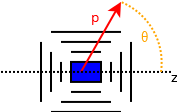

===================
An example analysis
===================

Overview
========

This example analysis should give a good overview of how to use ReMU. Use it to
look up recipes or work through it step by step. Each example depends on the
previous ones. They already include the expected output, so you do not need to
run them in order. Just be aware that due to the random nature of some of the
steps, the output of later examples might change if you (re-)run earlier ones.

The experimental setup
----------------------

The mock experiment that is handled in these examples is quite simple. It is
assumed to be perfectly cylindrical symmetric around the z-axis. All events
happen in the centre of the detector. It can be imagined as a target for a
neutrino beam, the interaction point of a collider, or a chunk of radioactive
material.

This target region is surrounded by particle detectors. Wrapped around the
z-axis is the "barrel region", which is closed by the end caps. Between end
caps and barrel is a small region that is not instrumented. Particles flying
along these lines cannot be detected.

Each event produces a single particle. Only one kind of particle exists. Since
the detector is perfectly symmetric around the z-axis, all events are perfectly
characterised by the particle's momentum and zenith angle.

Like every real detector, this mock detector has a momentum threshold. Below
his threshold, the efficiency of detecting events drops quickly to 0. Also,
because the barrel and caps are structurally different, the efficiency of
reconstructing events is different, depending on whether the particle passes
through the barrel or end caps.

There are only two kinds of events happening in the detector: signal events and
background events. The distribution of background events is assumed to be
pretty well known. The signal events are not well understood and understanding
them better is the point of this mock experiment. Of course, this being an
analysis of mock data, it would be easy to look into the generator code to see
the true nature of the signal events, but where is the fun in that? ;)

Examples
========

00 - Simple plotting of data
----------------------------

This example shows how to produce the data of the mock experiment, load it into
a Binning and plot the true and reconstructed distributions.

01 - Building a response matrix
-------------------------------

This example shows how to use simulated data to build a response matrix, and
test its model-independence.

02 - A simple model fit
-----------------------

This example shows how to use the response matrix and "real" data to do some
likelihood-based fits with different signal models.

03 - Detector uncertainties
---------------------------

This example shows how to incorporate detector uncertainties into the analysis.

04 - Markov Chain Monte Carlo
-----------------------------

This example shows how to use a Markov Chain Monte Carlo (MCMC) to construct a
Bayesian posterior distribution of model parameters.
